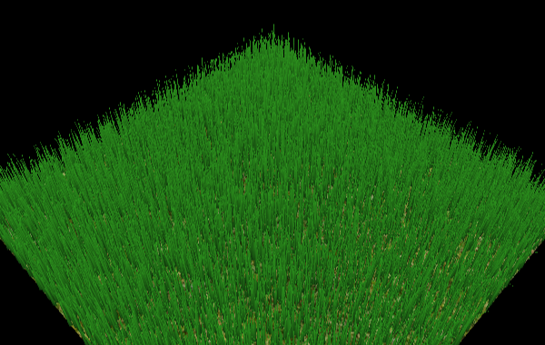
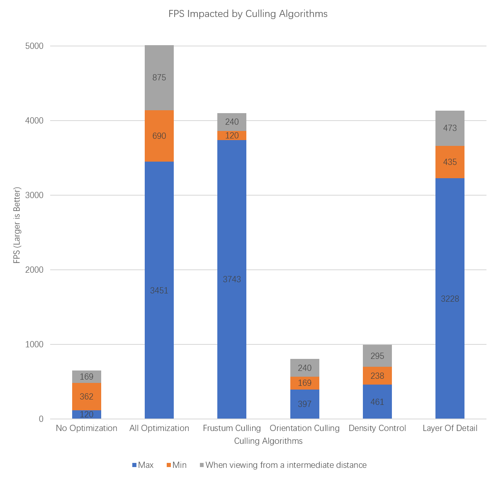

CUDA Denoiser For CUDA Path Tracer
==================================

**University of Pennsylvania, CIS 565: GPU Programming and Architecture, Project 3**

**[Repo link](https://github.com/IwakuraRein/Nagi)**

- Alex Fu
  
  - [LinkedIn](https://www.linkedin.com/in/alex-fu-b47b67238/)
  - [Twitter](https://twitter.com/AlexFu8304)
  - [Personal Website](https://thecger.com/)

Tested on: Windows 10, i7-10750H @ 2.60GHz, 16GB, GTX 3060 6GB

## Features


Rendering a large amount of grass that is subject to physical law at real-time speed. Reference: [Responsive Real-Time Grass Rendering for General 3D Scenes](https://www.cg.tuwien.ac.at/research/publications/2017/JAHRMANN-2017-RRTG/JAHRMANN-2017-RRTG-draft.pdf)

## Process

A blade can be represented as a Bezier curve with three points and two directions:


V0, V1, and V2 are the Bezier control points. The direction and up-vector, together with V0 can define the blade's world space position and orientation.

The initial representation of all blades is generated by the CPU. A blade is subjected to three forces: gravity, recovery, and wind. The compute shader will update the Bezier control points with certain laws and do the culling. Then tessellation shaders will generate the primitives based on the Bezier control points.

### Wind Field

By editing the vector `Wi` inside the compute shader we can define various wind fields:

<table>
    <tr>
        <th>$W_i = 0$</th>
        <th>$Wi = \sin(v_{0x}+\mathrm{time}) \cdot \sin(v_{0z}+\mathrm{time}) \cdot 15$</th>
    </tr>
    <tr>
        <th></th>
        <th></th>
    </tr>
    <tr>
        <th>$Wi = \sin(v_{0x}^2 + v_{0z}^2+\mathrm{time}) \cdot 15$</th>
        <th>$Wi = \sin(v_{0x} + v_{0z}+\mathrm{time}) \cdot 15$</th>
    </tr>
    <tr>
        <th></th>
        <th></th>
    </tr>
</table>

## Performance Analysis

65536 blades. The resolution is 640x480.

Click each embedded video to see how FPS varies as the camera moves around. After introducing several culling algorithms a huge improvement in performance can be seen.

<table>
    <tr>
        <th>Without optimization</th>
        <th>With optimization</th>
    </tr>
    <tr>
        <th><video src="https://user-images.githubusercontent.com/28486541/198902080-e6b77b6b-7390-4850-acbb-a21081033435.mp4"></video></th>
        <th><video src="https://user-images.githubusercontent.com/28486541/198902147-b79a9257-bbe3-489c-a04e-a1fcca21b790.mp4"></video></th>
    </tr>
</table>



### Frustum Culling

It is meaningless to draw blades that won't be captured by the camera. So we can cull the blades with camera frustum:

```cpp
vec4 ndc = camera.proj * camera.view * vec4(v0, 1);
ndc /= (ndc.w+1.0);
if (ndc.x > 1.0 || ndc.x < -1.0 || ndc.y > 1.0 || ndc.y < -1.0 || ndc.z > 1.0 || ndc.z < -1) return;
```

<video src="https://user-images.githubusercontent.com/28486541/198902121-b51ba328-61d3-4d0b-9051-5fdc18f2d990.mp4"></video>

We can see FPS is increasing when the camera is zooming in.

### Orientation Culling

Since our grass is represented by a quad thus no thickness, a blade is hard to see if its orientation is almost parallel to the camera's. So we can cull them:

```cpp
vec3 camPos = vec3(camera.view[3][0], camera.view[3][1], camera.view[3][2]);
if (abs(dot(fwd, normalize(v0-camPos))) > 0.9) return;
```

However, this only brings slight improvement.

<video src="https://user-images.githubusercontent.com/28486541/198902487-c843544c-c6a4-491b-846f-81b38c8552fa.mp4"></video>

### Density Control

We don't need to render all the grass when the camera is far away. So we can control the number of blades regarding distance:

```cpp
float z = length(v0 - camPos);
int level;
if (z < 8.0)
    level = 1;
else if (z < 16.0)
    level = 2;
else if (z < 32.0)
    level = 3;
else if (z < 64.0)
    level = 4;
else
    level = 5;
if ((idx+1) % level != 0) return; 
```

This increase the FPS when camera zooms out. However, the improvement doesn't meet the expectation.

<video src="https://user-images.githubusercontent.com/28486541/198902203-bcd3692b-bdf7-4992-a363-fe4aae4e5edd.mp4"></video>

### Layer Of Detail

If a blade is far away it doesn't need a high tesselation level. So in the tesselation control shader we can adjust the tessellation level regarding distance:

```cpp
int level;
if (z < 4.0)
    level = 16;
else if (z < 8.0)
    level = 12;
else if (z < 16.0)
    level = 8;
else if (z < 32.0)
    level = 4;
else
    level = 2;
gl_TessLevelInner[0] = level;
gl_TessLevelInner[1] = level;
gl_TessLevelOuter[0] = level;
gl_TessLevelOuter[1] = level;
gl_TessLevelOuter[2] = level;
gl_TessLevelOuter[3] = level;
```

This significantly increases the FPS.

<video src="https://user-images.githubusercontent.com/28486541/198902218-70e10287-f67f-4378-b859-8a412fbfda5b.mp4"></video>
