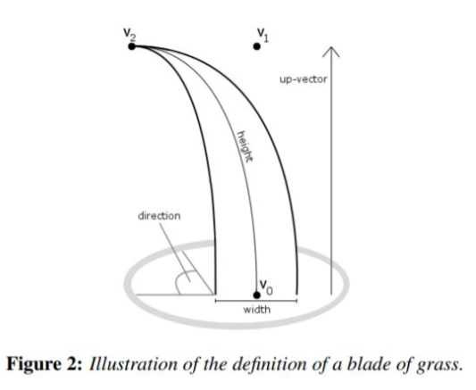
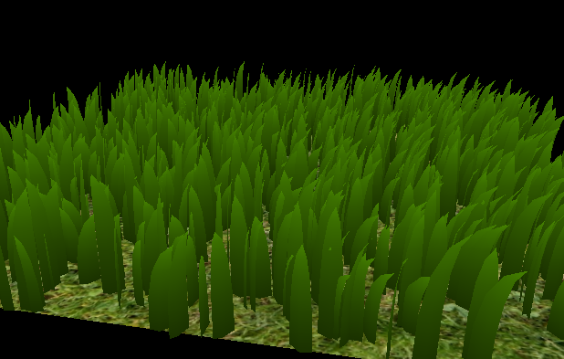

Vulkan Grass Rendering
==================================

**University of Pennsylvania, CIS 565: GPU Programming and Architecture, Project 5**

* Di Lu
  * [LinkedIn](https://www.linkedin.com/in/di-lu-0503251a2/)
  * [personal website](https://www.dluisnothere.com/)
* Tested on: Windows 11, i7-12700H @ 2.30GHz 32GB, NVIDIA GeForce RTX 3050 Ti

## Introduction

This is my first Vulkan project, which simulates grass movement in an outdoor environment based on the paper: [Responsive Real-Time Grass Rendering for General 3D Scenes](https://www.cg.tuwien.ac.at/research/publications/2017/JAHRMANN-2017-RRTG/JAHRMANN-2017-RRTG-draft.pdf)

This simulation is broken into three parts: Tessellation of the grass blade into some particular shape (in my case, a quadric knife shape), physics calcuations in a compute shader for grass movements, and culling unnecessary blades for performance. For the physics element of the simulation, the following three environmental forces are considered:
- Recovery: A force based on stiffness of a blade that counteracts external forces of gravity and wind
- Gravity: Gravitational force from the ground
- Wind: Force applied by wind and air
- Result Validation (to clamp the recalculated blade shape's length and position)
- **Note that the paper also specifies Collision force, but we don't take that into account here**

## Core Features and Results

### 1. Grass Shape Tessellation

At the initial stage of the project, there is only a patch of dirt with no visible grass on it. This is because all grass blades initially are represented by one vertex. In order for grass blades to appear, we must tessellate the vertex into a surface curve that represents the grass blade's shape. Based on Real-Time Grass Rendering, grass can be suggested to follow these possible curves:

For my project, I chose #3, the quadric "blade" shape for my grass.

Furthermore, each grass blade is controlled by a series of control points illustrated by the following diagram:

- `v0`: fixed base point of a grass blade
- `v1`: this point is "interpolated"/calculated as a response to `v2` and `v0`
- `v2`: this point gets moved based on the environmental forces
- `up`: The blade's up vector which sprouts from the ground upward in the Y direction. This is the same as the normal of the pane.

Each of the above points are represented as `vec4s` where the element _w_ (fourth element) represents the following:

- `v0.w - theta`: angle of rotation of the grass blade. This is different for every blade of grass which will give variety to the grass patterns.
- `v1.w - blade height`: height of the grass blade
- `v2.w - blade width`: width of the base of the blade
- `up.w - blade stiffness`: stiffness of the blade/resistance towards the environmental forces

Here is the simulation without any forces:

### 2. Environmental Forces

There are three environmental forces that impact the grass blade:

- Recovery: A force based on stiffness of a blade that counteracts external forces of gravity and wind
- Gravity: Gravitational force from the ground
- Wind: Force applied by wind and air

#### Gravity

With only gravity active, all grass blades will collapse to the ground. Gravitational force is a combination of `frontal gravity` and `downward gravity`. Environmental gravity acts along a vector of influence which is orthogonal to the width of the blade of the grass (along the face forward direction of the grass). Here is an image of the result with just gravity:

#### Resistance

Resistance factor is calculated by taking into account a stiffness constant defined by each grass blade. We essentially render the blade between the fully upstanding position and the collapsed ground position.

#### Wind

Wind factor is calculated by using a procedural sinusoidal wave and fbm noise to calculate some noise factor applied to the vector displacement.

### 3. Culling

#### Rotational Culling 

Rotational Culling removes blades such that its face-forward is exacty orthongal to the camera view vector towards the blade. This is because a blade has no thickness, so at that angle, there is no reason to send it to the render pipeline.

#### Frustum Culling

Frustum Culling removes blades that are outside of your viewport. With my implementation, there is a slight border where I remove blades within the frame as well so you can see the effect more clearly.

#### Distance Culling

Distance Culling removes blades that are outside of a certain distance.

## Performance Analysis

**Performance Measurements vs. Number of Blades**

**Performance Measurements vs. Different Culling Methods over an increasing number of blades**

## Bloopers! :)
