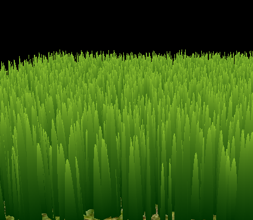
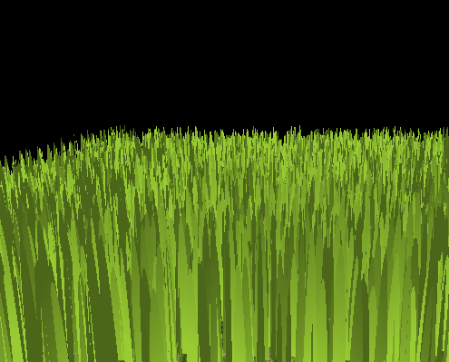
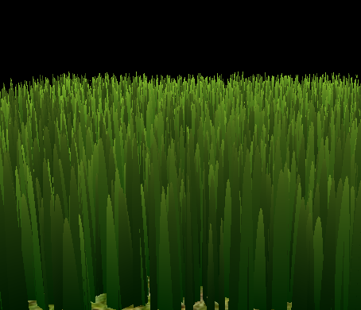
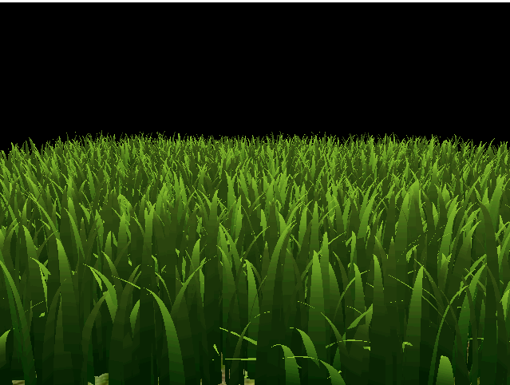
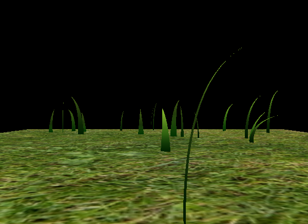
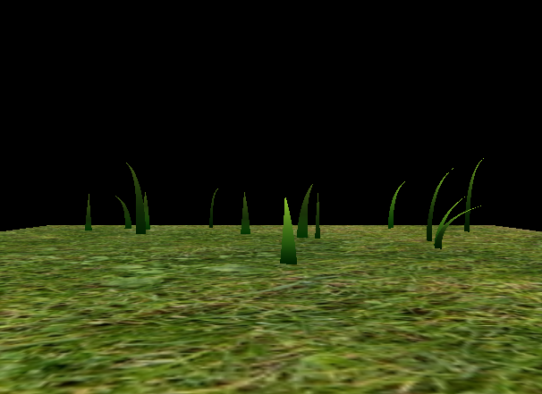
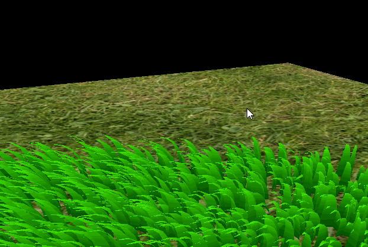

Vulkan Grass Rendering
==================================

**University of Pennsylvania, CIS 565: GPU Programming and Architecture, Project 5**

* Zhangkaiwen Chu
  * [LinkedIn](https://www.linkedin.com/in/zhangkaiwen-chu-b53060225/)
* Tested on: Windows 10, R7-5800H @ 3.20GHz 16GB, RTX 3070 Laptop GPU 16310MB (Personal Laptop)

This project implement a a grass simulator and renderer, which is based on the paper ["Responsive Real-Time Grass Rendering for General 3D Scenes."](https://www.cg.tuwien.ac.at/research/publications/2017/JAHRMANN-2017-RRTG/JAHRMANN-2017-RRTG-draft.pdf). 

||

## Core Features
* Shading Pipeline
* Tessellation
* Fragment Shader
* Force Simulation
* Culling

**Tessellation and Fragment Shader**

The shape used by tessellation can be controlled by the interpolation parameter between two curve points. We use the triangle shape, which is `t = u + 0.5v - uv`, where uv are generated by tessellation. The curve points are generated by De Casteljan's algorithm. After generating the blade geometry, we implement the fragment shader by using a gradient green texture on the grass, combined with lambertian shading. Here is the result after implementing these two steps:

| Gradient Green | Lambertian Shading | Gradient Green + Lambertian Shading |
|---|---|---|
|||

**Gravity and Recovery**

Given the gravity vector `D`, the environmental gravity is given by `gE = normalize(D.xyz) * D.w`, and the front gravity is computed as `gf = (1/4) * ||gE|| * f`, where `f` is the front facing direcction of the blade. The Recovery is simulated by Hooke's law. Let `iv2` denote the original position of `v2`, the recovery force is given by `r = (iv2 - v2) * stiffness`.  
| Grass with Gravity and Recorvey | 
|---|
||

**Wind**

We simulate wind by simple wave functions. Since there are no requirements for initial states, `abs(cos(a * t + b * f(v0)))` is enough to simulate planner wave and spherical waves. "Responsive Real-Time Grass Rendering for General 3D Scenes."](https://www.cg.tuwien.ac.at/research/publications/2017/JAHRMANN-2017-RRTG/JAHRMANN-2017-RRTG-draft.pdf) also provide a method to process the alignment of the blade towards the wind.
| Plannar Wave | Plannar Wave with Alignment |
|---|---|---|
|||

| Spherical Wave | Spherical Wave with Alignment |
|---|---|---|
|||

**Orientation Culling**

Due to the pseudo three-dimensionality of the grass blade, we can cull the blades by the alignment of the viewing direction and the vector along the width of the blade. 

| Naive | Orientation Culling|
|---|---|
|||

**View-frustum Culling**

The projection of a point on the image can be calculated by multypling the position of the point with the view-projection matrix. We can check whether the bottom, the middle and the top point is on the image to know whether this blade will appear in the view. A small tollerance is added in case the blade is still visable after failing the tests due to its width. A minous tollerance can help us check the performance of the view-frustum culling:

||

**Distance Culling**

A field of grass seems denser when it is far from the carmera, thus, we can make the grass field sparser with the increase of the distance to the camera. This can also prevent shading blades that are smaller than one pixel.

||