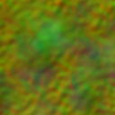
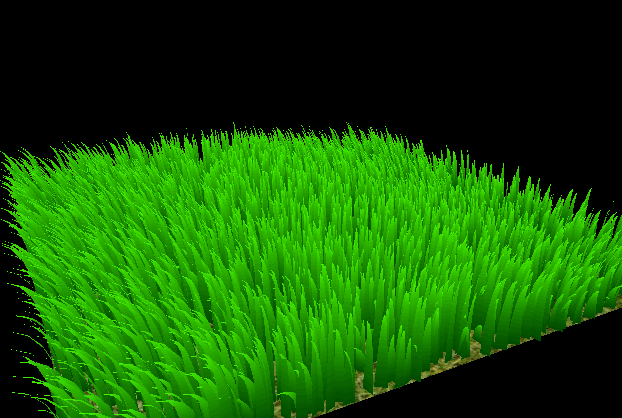
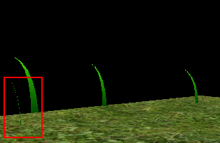
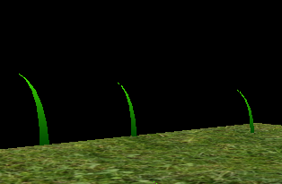
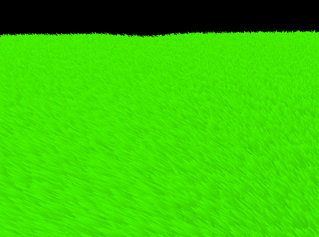
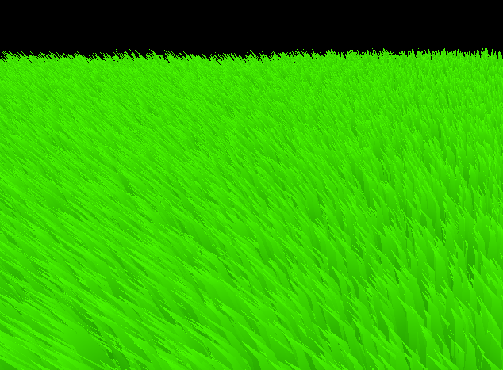
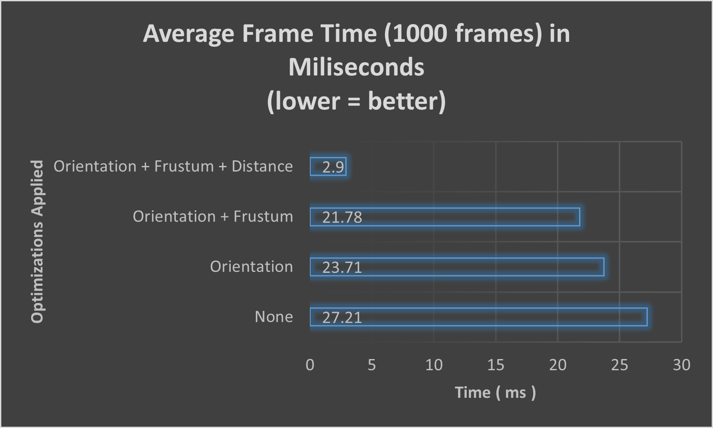
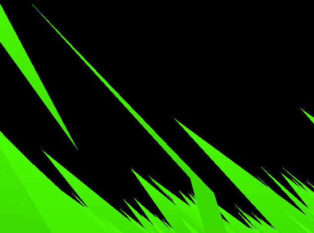
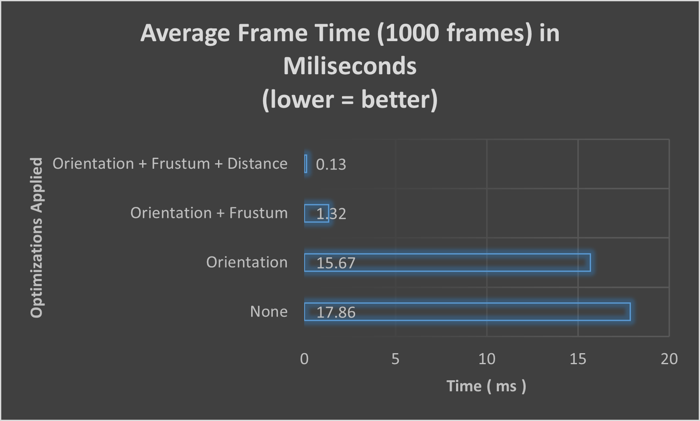

## 
 University of Pennsylvania, CIS 565: GPU Programming and Architecture 

# 
 Project 5 : Vulkan Grass Rendering 

- Name: Tongwei Dai
	- [LinkedIn Page](https://www.linkedin.com/in/tongwei-dai-583350177/)
- Tested on: Windows 10, i7-8700 @ 3.20 GHz 16GB, RTX 2070

## Overview
- This project implements the grass rendering techniques described in the paper [Responsive Real-Time Grass Rendering for General 3D Scenes](https://www.cg.tuwien.ac.at/research/publications/2017/JAHRMANN-2017-RRTG/JAHRMANN-2017-RRTG-draft.pdf) using the [Vulkan Framework](https://vulkan.lunarg.com/)

## Grass Representation
- Each grass is represented by a Bezier Curve of degree 2 (3 control points) and the width of the grass. The grass is assumed to have no thickness.
- The orientation of the grass is defined by an up-vector and an angle representing the rotation of the grass w.r.t. its up-vector. In this project, the up vector is always assumed to be the same as the world up, i.e. (0,1,0). 

- Forces are only applied at the last control point (v2) of the Bezier curve.

## Force Simulation
- There are 3 types of forces acting the grass. Namely, gravity, recovery force, and wind force.
    - gravity pulls the grass downwards depending on how bent it is.
    - recovery adds some elasticity that counteracts the effects of gravity; it depends on the stiffness of each grass.

### Noise Texture for Wind Simulation
- A noise texture is used to introduce the randomness of the wind forces on the grass.

- The RGB channels of the texture are sampled to be used as the wind direction vectors in world space.
- For each grass, its world position is used as the UV coordinate to sample the noise texture and determine the direction of the wind acting on it. This creates a sense of uniformity: grass in close proximity to each other tend to be affected by similar wind directions.
- Specifically, `uv = world_pos * tiling + offset * total_time`
    - where `total_time` is the global simulation time since program start-up
- `tiling` and `offset` parameters allow us to control the locality and frequency of wind.
- for example,

| high offset | high tiling | high tiling + high offset|
|-|-|-|
||||

## Culling
### Orientation Culling
- Since grass doesn't have thickness in this implementation, we can cull the grass whose width directions are the same / exactly opposite of the view direction.
- This helps avoid artifacts when the projected pixels of the grass is less than the size of a pixel

| Before | After |
|-|-|
|||

### Frustum Culling
- The frustum test culls all the grass lying outside the camera's view frustum
- This can potentially improve performance when there are lots of grass outside the view frustum
- To illustrate the effect of frustum culling, we can scale the width of the clip space by half during the frustum test.

### Distance Culling
- Grass that are very far from the camera can produce aliasing artifacts, due to reasons much similar to the problem in orientation culling.
- Distance test groups the grass by their distance from the viewer (distance levels) up to a maximum distance. Any grass farther than the maximum distance away from the camera will be culled.
- The number of grass culled in a group increases as the group becomes farther from the camera. A group very far from the camera will have most of its grass culled.
- The following demo illustrates the effect of distance culling by limiting the maximum distance.

## Culling and Performance
- In this section, we investigate the performance impact of the 3 culling techniques.
- Performance Metrics
    - It is somewhat useless to measure the CPU time during frame rendering because of the asynchronous nature of GPU workloads.
    - Vulkan timestamp query is used to measure the time it takes to draw the entire scene (ground + grass)
    - The average frame time (accumulated over 1000 frames) is used as a measure of performance. Obviously, the lower the time, the better the performance.
- Test Specification
    - Tested on: Windows 10, i7-8700 @ 3.20 GHz 16GB, RTX 2070
    - Orientation Test Threshold is set to 0.9
    - For the distance test, the maximum distance is set to 20, the number of distance levels is set to 10.

### Test Scene 1
- There are 220 grass blades in the scene
- The Camera is position at (0, 4, 7), looking at (0, 1, 0), such that the view covers a lot of grass very far away.
    
| None | Orientation + Frustum + Distance Culling |
|-|-|
|||

- As shown, the Distance Culling leads to a significant improvement with scenes where there are an enormous amount of grass inside the view.

### Test Scene 2
- There are 220 grass blades in the scene
- The Camera is position at (0, 2.2, 7), looking at (0, 5.3, 0), such that most grass are outside the view frustum.

| None | Orientation + Frustum + Distance Culling |
|-|-|
|||

- As shown, the Frustum Culling leads to a significant improvement with scenes where there are an enormous amount of grass outside the view.
- In conclusion, using the above culling techniques will almost always result in performance improvement, because the tests indicate that performance is bottle-necked by drawing commands rather than the computation overhead introduced by culling tests.
