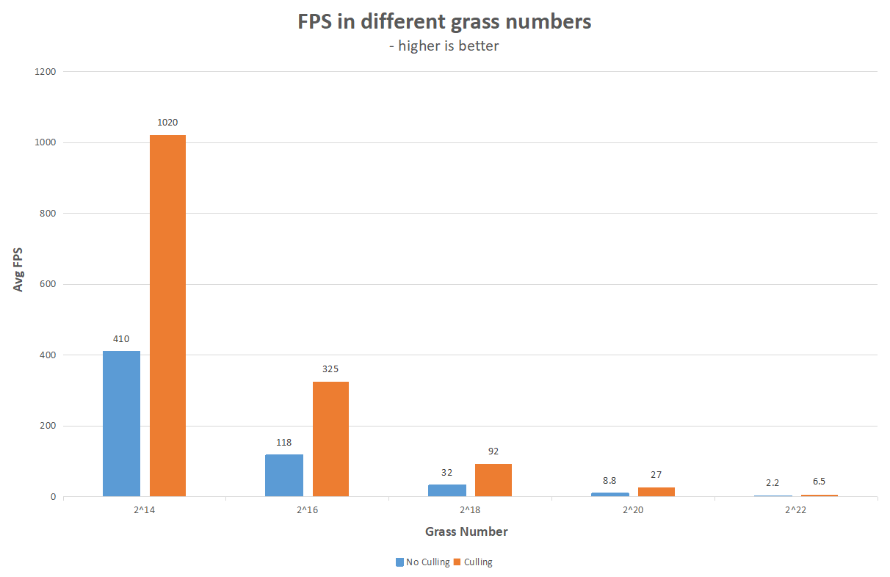
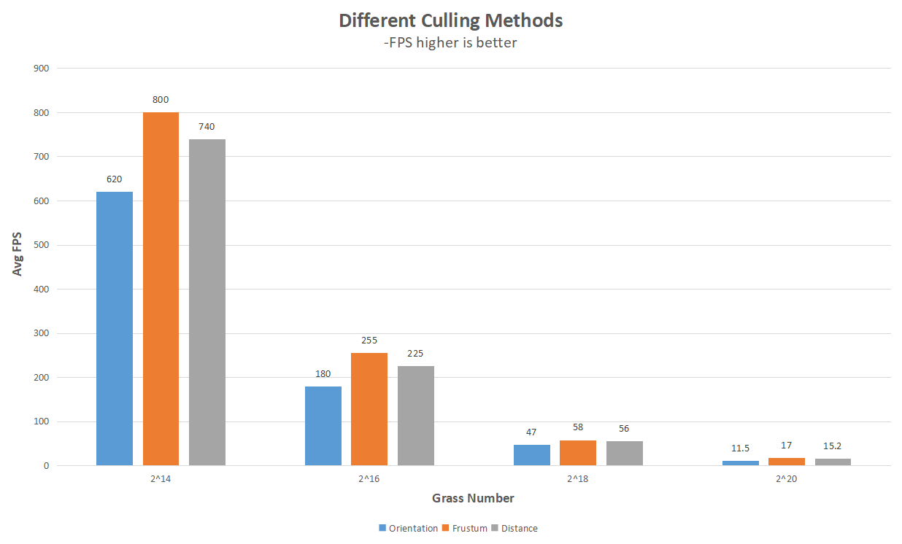

Vulkan Grass Rendering
==================================

**University of Pennsylvania, CIS 565: GPU Programming and Architecture, Project 5**

Jiajun Li

Linkedin: [link](https://www.linkedin.com/in/jiajun-li-5063a4217/)

Tested on: Windows 10, i7-12700 @ 2.10GHz, 32GB, RTX3080 12GB

CUDA Compute Capability: 8.6

## **Overview**

This project implements an efficient grass rendering using Vulkan based on [this paper](https://www.cg.tuwien.ac.at/research/publications/2017/JAHRMANN-2017-RRTG/JAHRMANN-2017-RRTG-draft.pdf).

## **Simulate Forces**

There are three type of forces in this simulation: gravity, recovery forces and wind.

### **Gravity**

Gravity consists of two components: a downward earth gravity gE and a front face gravity gF. The face gravity serves as a bending direction guide for the grass. Currently since gravity is the only force in the scene, grass will lay flat on the ground.

### **Recovery**

Recovery forces is the counterforce from the previous applied forces, and its direction points to the current position from the grass initial position. This way grass will be simulated as a mass-spring system and will produce a realisic feeling. With recovery forces added, the grass now can stand on the ground.

### **Wind**

Wind force is the custom part of this project and can be varied in different implementations. In my implementaion, I applied an cosine wave forces in the direction (0.2, 0, 0.5) and add some 2D perlin noise so that the grass wave will look a little less 'uniform'.

### **Grass Culling**

There are three types of culling implemented: orientation culling, view frustum culling and distance culling.

### **Orientation Culling**

Orientatioin culling method takes the dot product of grass width direction and view direction. If the dot product is greater than a certain threshold (the threshold in the above gif is 0.9), then it means grass is almost perpendicular to the camera and thus will be culled.

### **View Frustum Culling**

View Frustum Culling will cull grass outside the view frustum, which is determined by transforming the grass to NDC coordinates and check if the 2d point will be outsider a certain screen width. In the above example, the culling screen width is set to 80% percent of the sceen width so we can see that grass near the 10% percent of the edges in both left and right sides are culled.

### **Distance Culling**

Distance Culling will cull grass based on the distance between grass and camera. It designates grass into a serise of baskets and apply different portions of culling based on their distance(closer baskets will have less culling). In the above example, the max culling distance is 20.0 and the culling number N is 8.

## **Performance Analysis**

### **How culling improve performance**

In the above testing, all three culling are enabled and the camera is placed close to the center of the grass and the culling distance is set to a small number to ensure all three culling methods will have effects.

As we can see from the chart that FPS drops when grass number increasese. Moreover, for all situations, tests enabling culling have around <b>3 times higher</b> average FPS than tests where no culling applied. This shows that culling does help incrase performance in an effective way.

### **Impact of each culling method**

 The camera is placed near the center of the grass plane again so all culling methods will actually have effects. The face culling threshold is 0.9, the view frustum culling width is 110% and the distance culling distance is 20 and N is 8. 

As we can see from the chart, frustum culling has the overall best performance, followed by distance culling, then the orientation culling. They all have improved performance than not culling in the previous culling analysis.

One thing to notice is that the culling result greatly depends on camera position and culling configurations so the above result should only apply to this perticular setting.
