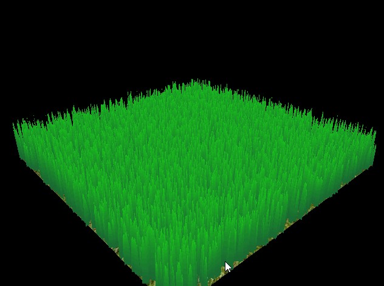
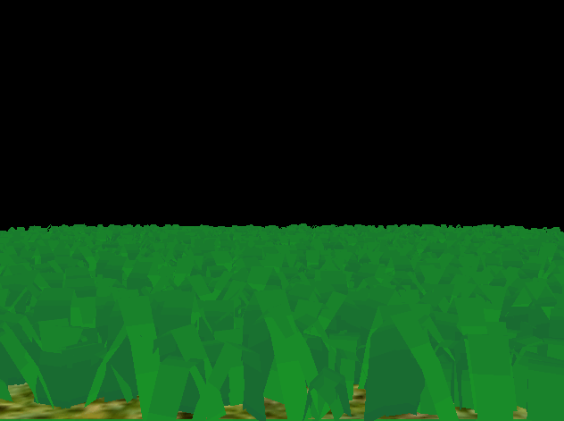
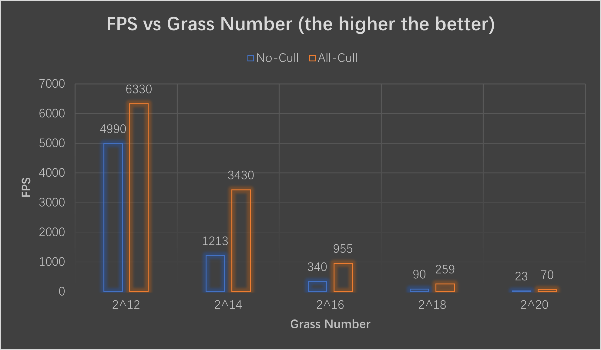
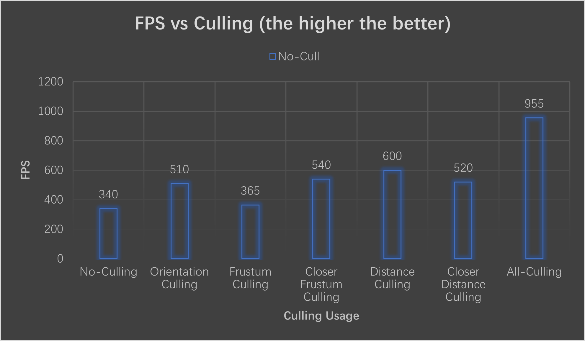

Vulkan Grass Rendering
==================================

**University of Pennsylvania, CIS 565: GPU Programming and Architecture, Project 5**

* Runshi Gu
  * [LinkedIn](https://www.linkedin.com/in/runshi-gu-445648194/)
* Tested on: Windows 10, AMD Ryzen 7 5800X 8-Core Processor @ 3.80 GHz 32GB, RTX3070 24538MB, Personal

## Overview

 

This is a grass rendering Vulkan project based on the paper [Responsive Real-Time Grass Rendering for General 3D Scenes](https://www.cg.tuwien.ac.at/research/publications/2017/JAHRMANN-2017-RRTG/JAHRMANN-2017-RRTG-draft.pdf). Each blade of grass is modeled as a 2nd degree Bezier curve, which is subject to gravity, recovery, and wind forces.

## Grass Model

In this project, grass blades are represented as Bezier curves while performing physics calculations and culling operations. 

Each Bezier curve has three control points.
* `v0`: the position of the grass blade on the geomtry
* `v1`: a Bezier curve guide that is always "above" `v0` with respect to the grass blade's up vector (explained soon)
* `v2`: a physical guide for which we simulate forces on

Also store per-blade characteristics that help simulate and tessellate grass blades correctly.
* `up`: the blade's up vector, which corresponds to the normal of the geometry that the grass blade resides on at `v0`
* Orientation: the orientation of the grass blade's face
* Height: the height of the grass blade
* Width: the width of the grass blade's face
* Stiffness coefficient: the stiffness of our grass blade, which will affect the force computations on our blade

Pack all this data into four `vec4`s, such that `v0.w` holds orientation, `v1.w` holds height, `v2.w` holds width, and `up.w` holds the stiffness coefficient.

## Simulating Forces

There are three type of forces in this simulation: gravity, recovery forces and wind.

No Forces                     |  Gravity      
:----------------------------:|:----------------------------:
   |   

Gravity + Recovery            |  Gravity + Recovery + Wind
:----------------------------:|:----------------------------:
   |   

### Gravity

Given a gravity direction, `D.xyz`, and the magnitude of acceleration, `D.w`, we can compute the environmental gravity in our scene as `gE = normalize(D.xyz) * D.w`.

We then determine the contribution of the gravity with respect to the front facing direction of the blade, `f`, as a term called the "front gravity". Front gravity is computed as `gF = (1/4) * ||gE|| * f`.

We can then determine the total gravity on the grass blade as `g = gE + gF`.

### Recovery

Recovery corresponds to the counter-force that brings our grass blade back into equilibrium. This is derived in the paper using Hooke's law. In order to determine the recovery force, we need to compare the current position of `v2` to its original position before simulation started, `iv2`. At the beginning of our simulation, `v1` and `v2` are initialized to be a distance of the blade height along the `up` vector.

Once we have `iv2`, we can compute the recovery forces as `r = (iv2 - v2) * stiffness`.

### Wind

In order to simulate wind, you are at liberty to create any wind function you want! In order to have something interesting, you can make the function depend on the position of `v0` and a function that changes with time. Consider using some combination of sine or cosine functions.

Your wind function will determine a wind direction that is affecting the blade, but it is also worth noting that wind has a larger impact on grass blades whose forward directions are parallel to the wind direction. The paper describes this as a "wind alignment" term. We won't go over the exact math here, but use the paper as a reference when implementing this. It does a great job of explaining this!

Once you have a wind direction and a wind alignment term, your total wind force (`w`) will be `windDirection * windAlignment`.

### Total force

We can then determine a translation for `v2` based on the forces as `tv2 = (gravity + recovery + wind) * deltaTime`. However, we can't simply apply this translation and expect the simulation to be robust. Our forces might push `v2` under the ground! Similarly, moving `v2` but leaving `v1` in the same position will cause our grass blade to change length, which doesn't make sense.

Read section 5.2 of the paper in order to how to determine the corrected final positions for `v1` and `v2`. 

## Culling

There are three types of culling implemented: orientation culling, view frustum culling and distance culling.

Orientation Culling                   |  View Frustum Culling            |  Distance Culling
:------------------------------------:|:--------------------------------:|:--------------------------------:
   |   |  

#### Orientatioin culling

Consider the scenario in which the front face direction of the grass blade is perpendicular to the view vector. Since our grass blades won't have width, we will end up trying to render parts of the grass that are actually smaller than the size of a pixel. This could lead to aliasing artifacts.

In order to remedy this, we can cull these blades! Simply do a dot product test to see if the view vector and front face direction of the blade are perpendicular. The paper uses a threshold value of `0.9` to cull.

#### Orientatioin culling

We also want to cull blades that are outside of the view-frustum, considering they won't show up in the frame anyway. To determine if a grass blade is in the view-frustum, we want to compare the visibility of three points: `v0, v2, and m`, where `m = (1/4)v0 * (1/2)v1 * (1/4)v2`.

Notice that we aren't using `v1` for the visibility test. This is because the `v1` is a Bezier guide that doesn't represent a position on the grass blade. We instead use `m` to approximate the midpoint of our Bezier curve.

If all three points are outside of the view-frustum, we will cull the grass blade. The paper uses a tolerance value for this test so that we are culling blades a little more conservatively. This can help with cases in which the Bezier curve is technically not visible, but we might be able to see the blade if we consider its width.

#### Distance culling

Similarly to orientation culling, we can end up with grass blades that at large distances are smaller than the size of a pixel. This could lead to additional artifacts in our renders. In this case, we can cull grass blades as a function of their distance from the camera.

## Performance Analysis

 

In above testing, I compare the FPS changes with the total number of grass blades in the scene and I placed the camera so that most of the grass blades are shown in the screen while some are out of the screen, and I tested in both No-Culling and All-Culling enabled cases. 

As we can see the both cases' frame rates drop dramatically with the increase in the maganitude of amoung of grass blades while the culled one has a higher FPS.

 

In Aobve testing, I used 2^16 grass blades in scene and test No-Culling, All-Culling and three individual cullings. And I also change the distance of the camera to test the influence of grass in screen/distance to the grass to both View Frustum Culling and Distance Culling. The closer the camera is, the better the View Frustum Culling' effect because more grass are cut out of the screen and not rendered, but the Distance Culling is worse since less grass is culled out for shorter distance.