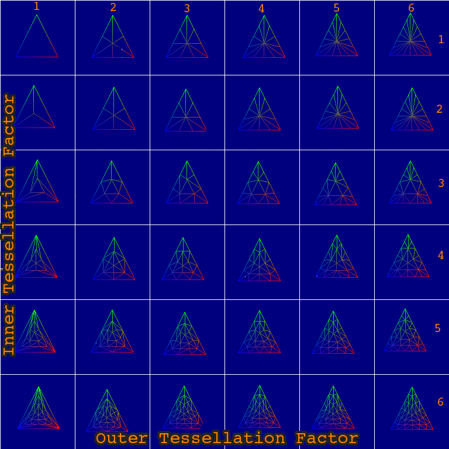
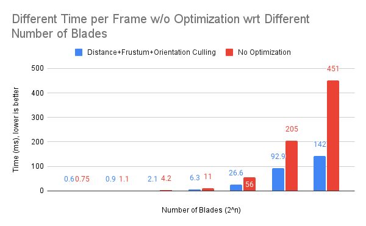

Vulkan Grass Rendering
==================================

**University of Pennsylvania, CIS 565: GPU Programming and Architecture, Project 5**


* Yilin Liu
  * [LinkedIn](https://www.linkedin.com/in/yilin-liu-9538ba1a5/)
  * [Personal website](https://www.yilin.games)
* Tested on personal laptop:
  - Windows 10, Intel(R) Core(TM), i7-10750H CPU @ 2.60GHz 2.59 GHz, RTX 2070 Max-Q 8GB

Overview
=============

A Vulkan-based grass renderer was implemented in this project. I used methods discussed in K. Jahrmann and M. Wimmer's paper ["Responsive Real-Time Grass Rendering for General 3D Scenes."](https://www.cg.tuwien.ac.at/research/publications/2017/JAHRMANN-2017-RRTG/JAHRMANN-2017-RRTG-draft.pdf). 

The simulation and rendering of the grass mainly includes the following parts: a vertex shader to transform Bezier control points, tessellation shaders to dynamically create the grass geometry from the Bezier curves, and a fragment shader to shade the grass blades.


Features
=============
### Blade Model

We use Bezier curve with three control points, V0 (position), V1 (up vector), and V2 (direction) to represent the blades. 


### Basic Grass

Specificly, we need to use tessellation shader to generate vertices. The process should be as followings:

First, we specify the detail of tessellation (inner level and outer level) in tessellation control shader

Then, the tessellation primitive generator will create a bunch of vertices according to details of tessellation. Each vertex carries a tessellation coordinate uv, which ranges from (0, 0) to (1, 1) if we use quad mode

Last, in tessellation evaluation shader, we decide the position of these new vertices based on their tessellation coordinates. For example, a vertex's position can be sampled on a height map using these coordinates position = texture(heightMap, uv)

After tessellation, these vertices are guaranteed to be assembled to the primitives we specify when creating the pipeline

### Wind Simulation
The alignment of the blade towards the wind wave is developed following two ideas: First, a blade of grass that is standing in its straight position should be influenced more by the wind than a blade that is pushed to the ground. In addition, if the direction of the force caused by the wind is directed
along the width of the blade, the influence should be less than if the direction of the wind is orthogonal to the blade. 

Performance Analysis
============
### Distance Culling

We can cull all the blades that are out of a distance to the camera. 


```cpp
#if DIST_CULL
	float dProj = length(v0 - eye_pos - up * dot((v0 - eye_pos), up));
	uint n = 10;
	if (mod(id, n) >= (n * (1 - dProj / dMax)))
	   return;
#endif
```

### Frustum Culling

We can cull objects which are out of camera's frustum. Note how the blades around edges of the screen are loaded.


```cpp
#if VIEW_CULL
	vec3 m = (1/4) * v0 * (1/2) * v1 * (1/4) * v2; // midpoint
	if(!(inFrustum(v0) && inFrustum(v2) && inFrustum(m)))
		 return;
#endif
```


### Orientation Culling

We can further cull blades that are parallel to the camera. 


```cpp
#if ORIE_CULL
	vec3 dirC = eye_pos - v0;
	vec3 dirB = orient;
	if (abs(dot(normalize(dirC), normalize(dirB))) >= 0.9)
	   return;
#endif
```

### Dynamic Tessellation Level

We also added a dynamic tessellation level to the tessellation control shader to control the inner and outer levels.

We can see from the gif below that the tessellation level changes as the camera goes away. 

 

Here is a diagram of how tessellation works in Vulkan. 




```cpp
vec3 camPos = inverse(camera.view)[3].xyz;

float z = length(tcV0in[gl_InvocationID].xyz - camPos);

int LOD;
if (z < 4.0)
	LOD = 16;
else if (z < 8.0)
	LOD = 12;
else if (z < 16.0)
	LOD = 8;
else if (z < 32.0)
	LOD = 4;
else
	LOD = 1;

gl_TessLevelInner[0] = LOD;
gl_TessLevelInner[1] = LOD;

gl_TessLevelOuter[0] = LOD;
gl_TessLevelOuter[1] = LOD;
gl_TessLevelOuter[2] = LOD;
gl_TessLevelOuter[3] = LOD;
```

### Analysis

The final table of comparision can be seen from the figue below.

  
 
We can see that as the number of blades increases, the rendering time increases almost linearly. However, if we enable the optimization methods, the rendering time could be significantly reduced. 


   
Reference
===============
* [Responsive Real-Time Grass Rendering for General 3D Scenes.](https://www.cg.tuwien.ac.at/research/publications/2017/JAHRMANN-2017-RRTG/JAHRMANN-2017-RRTG-draft.pdf). 