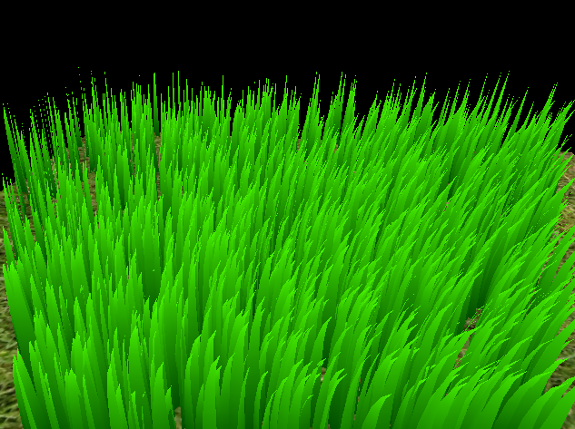

Vulkan Grass Rendering
==================================

**University of Pennsylvania, CIS 565: GPU Programming and Architecture, Project 5**

* Edward Zhang
  * https://www.linkedin.com/in/edwardjczhang/
  * https://zedward23.github.io/personal_Website/
 
* Tested on: Windows 10 Home, i7-11800H @ 2.3GHz, 16.0GB, NVIDIA GeForce RTX 3060 Laptop GPU

## Vulkan Grass Rendering 

This project is an implementation of the paper, [Responsive Real-Time Grass Rendering for General 3D Scenes](https://www.cg.tuwien.ac.at/research/publications/2017/JAHRMANN-2017-RRTG/JAHRMANN-2017-RRTG-draft.pdf).

## Tessellating Grass

We populate our scene by getting the necessary pipelines and tessellation shaders to depict each blade of grass as a bezier curve. As there are no forces active, the curves remain static.

## Force Application

To give the grass a more dynamic appearance, we apply three forces to the control points of our bezier grass, as per the paper being implemented. 
1. Gravity - Gives the grass a natural curve
2. Recovery - Takes the stiffness of a blade of grass into account; otherwise the gravity would cause all the blades of grass to fall to the ground.
3. Wind - Simulated wind using Fractional Brownian Motion perterbed by sinusoidal functions.

The applied forces together per frame update yields the result above.

## Culling Optimizations

### Frustrum and Distance Cull

As an optimization, we do not render any grass that is either too far away from from the camera or falls outside of the camera's view frustrum. This way, we only render grass that is actually seen by the camera.

### Orientation Cull

Due to the fact that grass blades are being represented as 2D bezier curves, another optimization is simply not drawing the grass that has its flat portion faces the camera (within a certain margin). 

## Performance Tests

Grass blade counts are increased by powers of 2; here the X axis is transformed by the log operation for the sake of readability; this transformed X axis better demonstrates diminshing returns of the culling optimization based on the increases in grass blades in the scene.

Here's the performance chart without the log transformation.

Here are two graphs presenting the framerate of our grass scene vs the total number of grass blades in the scene with and without the culling optimizations implemented above. What we can see is that the optimizations allow us to maintain a higher framerate for larger amounts of grass before also succumbing to the computational demands the sheer density of grass scenes entails. 

