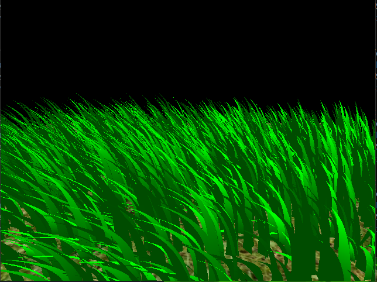
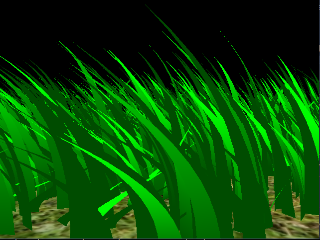
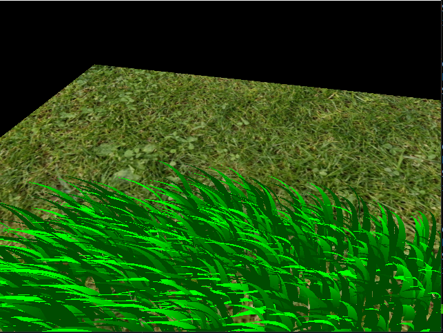
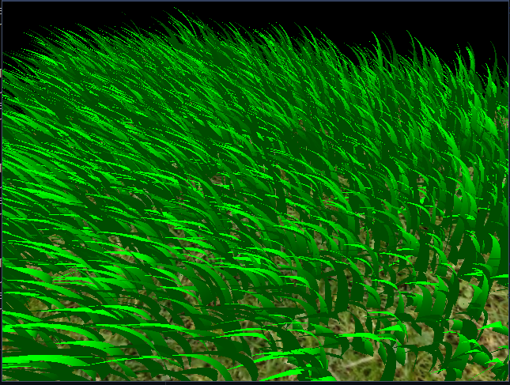

## 
 University of Pennsylvania, CIS 565: GPU Programming and Architecture 

# 
 Vulkan Grass Rendering 

* Shutong Wu
  * [LinkedIn](https://www.linkedin.com/in/shutong-wu-214043172/)
  * [Email](shutong@seas.uepnn.edu)
* Tested on: Windows 10, i7-10700K CPU @ 3.80GHz, RTX3080, SM8.6, Personal Computer 

## Overview

In this project I implemented the grass rendering techniques in the paper [Responsive Real-Time Grass Rendering for General 3D Scenes](https://www.cg.tuwien.ac.at/research/publications/2017/JAHRMANN-2017-RRTG/JAHRMANN-2017-RRTG-draft.pdf) using Vulkan framework. 
The main components of this project includes:
- [Grass Simulation](#grass-simulation)
- [Grass Culling](#grass-culling)
- [Grass Rendering](#grass-rendering)

## Grass Simulation

- In this Project, grass blades are represented as Bezier curves while performing physics calculations and culling operations.
- We will have three control points, v0, v1, v2, for each blade, and we will have the height/width/orientation/stiffness and the up vector to start with.

### Gravity Simulation
Gravity is the essential force we add to the grass. It makes sure grass will have a simulated bending affect with extra forces. With only gravity force and no other force simulation grass will of course crumble to the ground, which will not be shown in this section.

### Recovery Simulation
With the stiffness factor, recovery simulates grass's mass-spring system so it will not fall into the ground with extra forces like strong wind force.

### Wind Simulation
Wind force can generate more live images with grass. In this simulation I used a 2d noise algorithm to add more randomness to the wind.

- We also have a wind force that can controls how strong the wind is. The gif above is using a wind force of 3, below is using a wind force of 5, and you can see the grasses bend more than the previous one.

When we are done with all the simulation, we still need to do a validation to prevent behaviors like V2 pushed to the ground or V2 moving but V1 staying in the same position.
## Grass Culling
To cull blades that do not need to be rendered, we use three techniques to cull blades.
### Orientation Culling
Because grass does not have thickness in this project, we will cull the grass that has the same/exactly opposite direction as the view direction.

### View-Frustum Culling
Cull blades outside of the view frustum is an essential in this project, and I use a small tolerance value to cull blades more conservatively. When there are a lot of grasses outside the view frustum, this can significantly improve the performance. 
This gif is taken when I choose a comparatively large tolerance value to cull the blades.

### Distance Culling
- Distance culling technique will cull blades that are outside of a certain distance, based on camera and blade's positions.
- We will have a max distance, so that blade's distance larger than the max distance will be culled;
- We will also group grasses by levels based on their distance from the viewer.

This is how distance level works on the grass: 
Distance Level 7     |  Distance Level 15
:-------------------------:|:-------------------------:
   |  

## Grass Rendering
- Rendering is done using Vulkan's render pipeline. Each blade is passed as a vertex in the vertex shader and its color and lighting effect set in the fragment shader;
- In Vulkan's Tesselation Control Shader and Tessellation Evaluation shader, we set the tessellation level and implement the interpolation using de'castaljau algorithm. 

## Performance Analysis
In this performance analysis we mainly analyze how culling including the three different culling techniques improves performance in terms of runtime and total blades culled. 
- Testing FPS is similar to test the total blades drawed in current frame but easier. 
- We will use FPS to mesaure the performance, higher the FPS better the performance.
### Performance Test

- From the graph above we can see that with more blades/triangles to draw, frame rate starts to decrease linearly
- With more culling techniques added, the performance will be better because there will be fewer blades to draw
- They all have their own best performance improvement scenario: View-Frustum when only few blades in the screen; distance culling when the camera is in a relatively long distance from the grasses; orientation culling when camera is facing towards the up vector of many grasses. They will all create performance improvement in this scenario generally.

