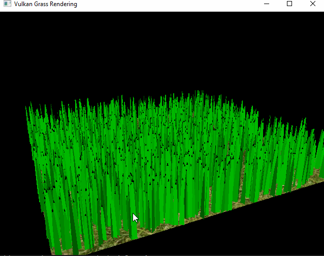
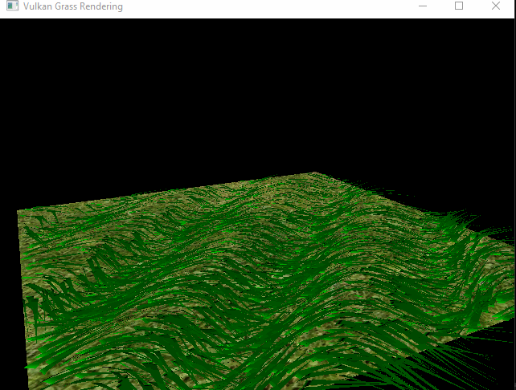
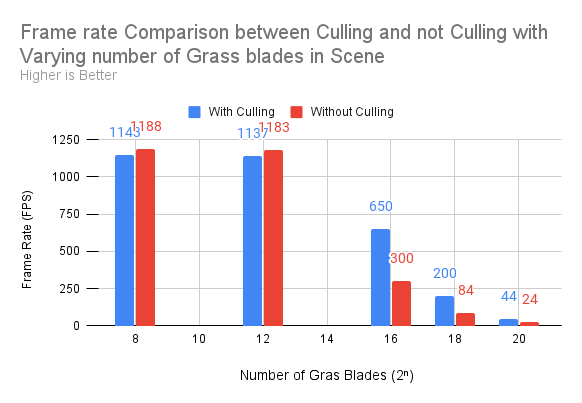
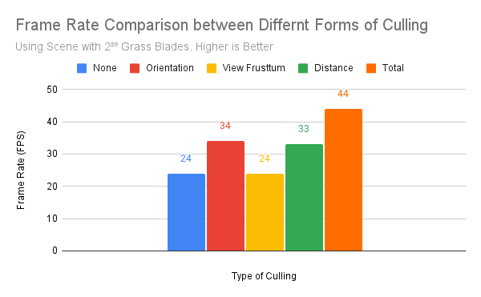

Vulkan Grass Rendering
==================================

**University of Pennsylvania, CIS 565: GPU Programming and Architecture, Project 5**

* David Li
* [LinkedIn](https://www.linkedin.com/in/david-li-15b83817b/)
* Tested on: Windows 10, Intel(R) Core(TM) i9-10980HK CPU @ 2.40GHz 32Gb, GTX 2070 Super (Personal Computer)

[Repo Link](https://github.com/theCollegeBoardOfc/Project5-Vulkan-Grass-Rendering)

## Summary

This project uses Vulkan to simulate grass blades, following this [paper](https://www.cg.tuwien.ac.at/research/publications/2017/JAHRMANN-2017-RRTG/JAHRMANN-2017-RRTG-draft.pdf) on responsive real time grass rendering. Two primary pipelines are used to draw the grass blades. The grass pipelline uses a vertex, tessellation control, tessellation evaluation and fragment shader. The blades are first sent to the vertex shader as three controls points and an up vector. We also encode some extra data inside these vectors such as blade width and height. These are then passed to the tessellation control shader which determines the level of tessellation. Next is the tessellation evaluation shader which uses the tesselation uv coordinates to interpolate between the control points and generate the shape of the grass blade. The positions generated from this level are passed to the fragment shader where lambert's law is used to generate the color of the grass. The other pipeline is the compute pipeline. Using the compute shader, the forces of wind, gravity and blade stiffness are simulated, and used to translate the blade control points. The compute shader also culls grass blades based on their orientation, distance from the camera and whether they exist within the view frustrum. The blade culling is done to improve the performance of the program, and has significant effect at higher blade counts.

## Progression

The biggest challenge was generating the grass blades without any sort of simulation. Here is the result of that. 
 

### Forces
Next, the windforce was applied to each of the blades based on the position of the base of the grass. 
 

 
Afterwards, the force of gravity is applied. Since there is nothing to push the grass blades back up, all control points are pushed to the ground.
 

 
Last for the simulation, a recovery force is added to counteract the gravity and wind, pushing the grass blades to its neutral position.
 

 
### Culling
Now all the different sort of face culling is added. Here is what the orientation culling is added. Orientation culling occurs when the face of the blade is close to being perpendicular to the camera. The blade count has been reduced for clatiy.

 
Frustrum culling removes blades that would not be present in the view frustrum and thus would not be seen anyway.
 

 
Distance culling removes all blades that are sufficiently far from the camera, and also starts culling a percentage of blades at different distance intervals.
 

 

## Performance Analysis

 
This first chart indicates the frame rate of the simulation while simulation varying number of blades. The increase in blades is exponential, so the final value tested was 2 to the power of 20, which is over a million blades of grass simulated. 
 

 
At lower blade counts, culling has little effect on performance, but at higher blade counts the performance increase is drastic. Doubling the performance in some cases. 
 

 
This second and final chart, shows the frame rate using different culling methods. The scene that was tested had two to the power of 20 blades in it. What should be noted is that many of the culling methods depend on the position of the camera. For example, pulling the camera very far back would activate the distance culling, but not the frustrum culling. All these measurements were taken with the entire scene visible. 
 

 
As should be expected. The view frustum culling had little effect as there was nothing to cull, while the distance and orientation culling had about similar effects on performance.

## Resources

### Links

The following resources were referenced during the construction of the project.

* [Responsive Real-Time Grass Grass Rendering for General 3D Scenes](https://www.cg.tuwien.ac.at/research/publications/2017/JAHRMANN-2017-RRTG/JAHRMANN-2017-RRTG-draft.pdf)
* [CIS565 Vulkan samples](https://github.com/CIS565-Fall-2017/Vulkan-Samples/tree/master/samples/5_helloTessellation)
* [Official Vulkan documentation](https://www.khronos.org/registry/vulkan/)
* [Vulkan tutorial](https://vulkan-tutorial.com/)
* [RenderDoc blog on Vulkan](https://renderdoc.org/vulkan-in-30-minutes.html)
* [Tessellation tutorial](https://ogldev.org/www/tutorial30/tutorial30.html)
* [FPS Counter](https://github.com/VictorGordan/opengl-tutorials/tree/main/YoutubeOpenGL%2016%20-%20Face%20Culling%20%26%20FPS%20Counter)
