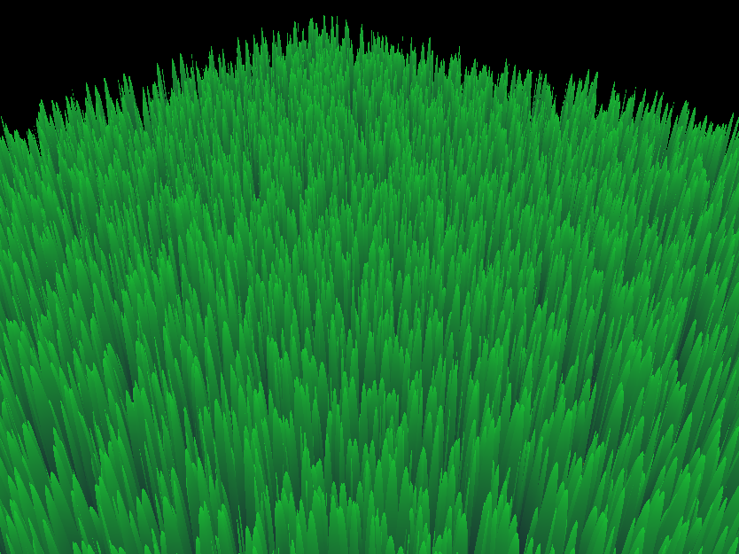
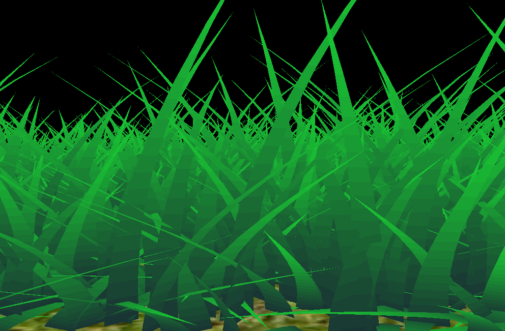
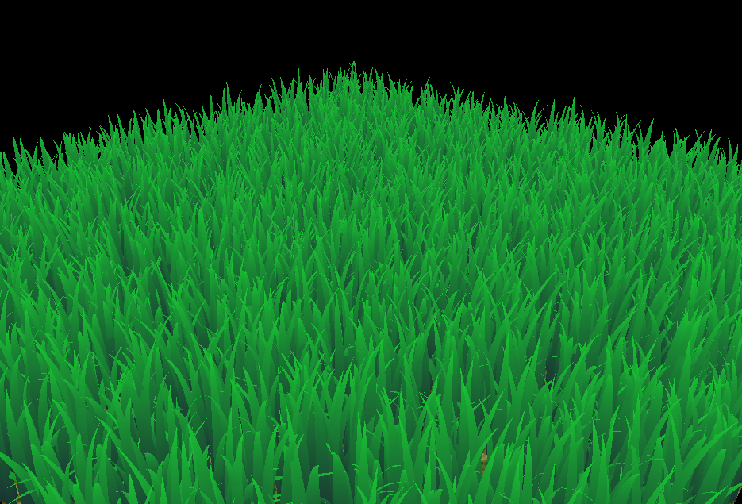
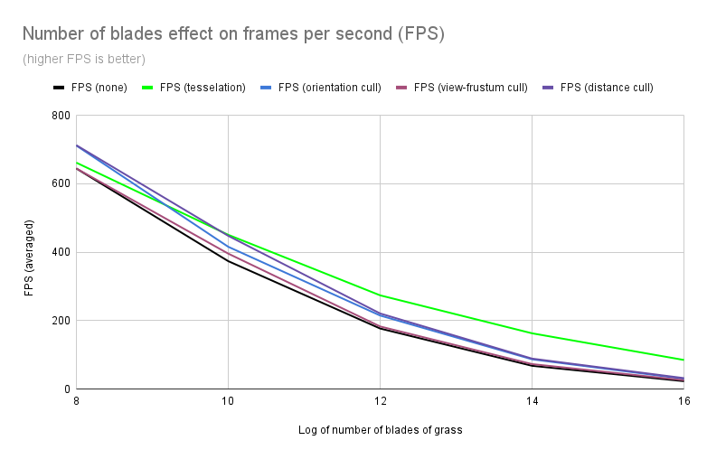
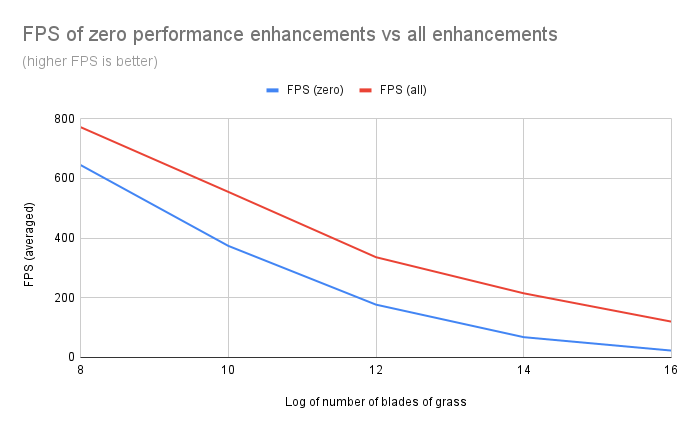

Vulkan Grass Rendering
==================================

**University of Pennsylvania, CIS 565: GPU Programming and Architecture, Project 5**

* Evan S
* Tested on: Strix G15: Windows 10, Ryzen 7 4800H @ 2.9 GHz, GTX 3050 (Laptop)

## Overview

This is a grass rendering project based on the paper [Responsive Real-Time Grass Rendering for General 3D Scenes](https://www.cg.tuwien.ac.at/research/publications/2017/JAHRMANN-2017-RRTG/JAHRMANN-2017-RRTG-draft.pdf). Each blade of grass is modeled as a 2nd degree [Bezier curve](https://en.wikipedia.org/wiki/B%C3%A9zier_curve), which is subject to gravity, restorative, and wind-based forces. See the paper for further information.

To achieve optimal performance, the project is implemented in Vulkan.

### Features

#### Forces
The static grass is enabled through Vulkan overall, but forces in particular are calculated in the compute shader, and applied to a weight for the Bezier informing the grass tesselation. 

Before any forces, the grass is a static bunch that sticks straight up, and looks somewhat unusual.

##### Gravity

To the left is only the force of gravity on the blades of grass; on a technical level, it is applied to the tip of the blade. As expected, without any recovery force, they immediately collapse to the ground. Note that the gif uses a lower magnitude of gravity, to better show the blades as they collapse.
 

##### Recovery

To the left is the force of gravity plus the recovery force, which is essentially an implementation of Hooke's law. In this case, there is a degree of stabilization that happens, so the blades don't fully collapse to the floor, and we end up an equilibrium between the force of gravity and the recovery force. Contrast this with the static grass image, and note that what we have looks much more "grass-like".
 

##### Wind

Wind is implemented as a noise function. This allows the modeling of a few different types of wind behavior. To the left, a sinusoidal noise function for emulates a breeze passing through the grasses.
 

#### Culling
To further improve performance/visuals, we can cull some of the unnecessary blades of grass.

##### Orientation culling

Since our blades are just 2D models, if viewed parallel to their width, they are essentially a line - not even worth rendering. Orientation culling addresses this by removing blades that are aligned with the camera's view, according to a tune-able threshold. The left depicts this with a sparse field of grass for visual clarity. 
 

##### View-frustum culling

[View frustum](https://en.wikipedia.org/wiki/Viewing_frustum) culling is when blades of grass outside the truncated pyramid of view are removed to improve performance - we don't see them anyways. To the left, we have highly aggressive culling from a narrow view frustum.
 

##### Distance culling

Faraway grass blades can be smaller than a pixel. To avoid z-fighting/rendering artifacts, blades beyond a tune-able distance from the camera are culled such that a "max distance" is enforced where blades of grass will always be culled, with decreasing likelihood of being culled as the blade approaches the camera's position.
 

#### Tesselation LOD

The level of tesselation can be lowered when blades of grass are further from the camera. To the left, a sparse field of grass becomes more polygonal (the far blades become a straight-up triangle) as the camera moves further, and gain more polygonal detail as the camera moves closer.
 

### Performance Analysis
Below is a chart describing performance of the renderer with respect to the log of the number of grass blades, measured in frames per second(FPS). FPS is averaged over 60 seconds.

The chart compares some of the performance optimizations to regular performance.

The settings for tesselation default to `20`; for changing tesselation LOD the level can go down to `10, 5, 3, 1`, depending on distance.    
The orientation is culled according to a threshold setting of `0.9`.   
The view-frustum is culled according to a tolerance of `0.95 * frustum`.   
The distance is culled with `10` buckets and a maximum distance of `40` units.

Finally, below is a chart comparing zero vs all of the optimizations.

