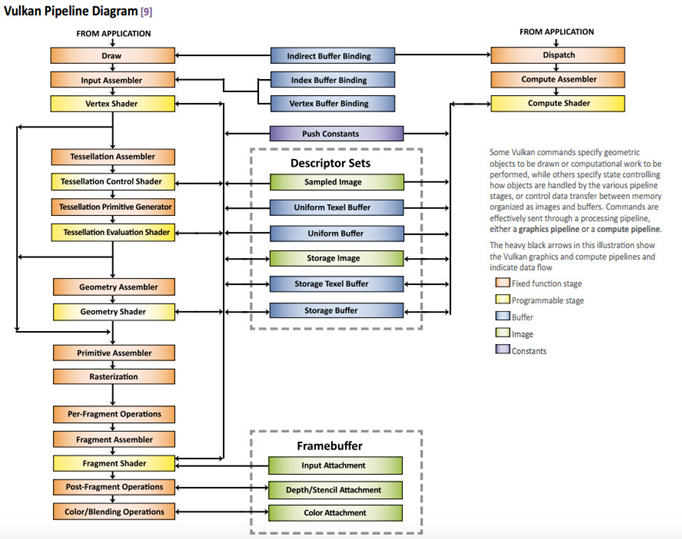
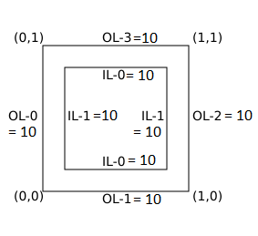
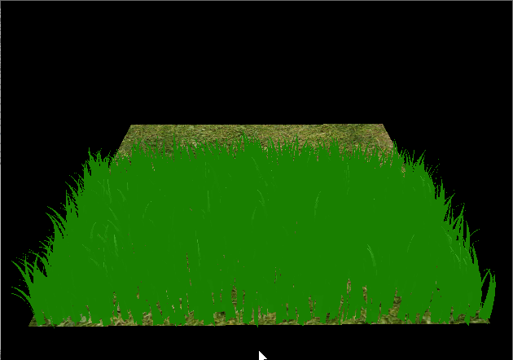

Vulkan Grass Rendering
==================================

**University of Pennsylvania, CIS 565: GPU Programming and Architecture, Project 5**

* RHUTA JOSHI
  * [LinkedIn](https://www.linkedin.com/in/rcj9719/)
  * [Website](https://sites.google.com/view/rhuta-joshi)

* Tested on: Windows 11 Home - 21H2, AMD Ryzen 5 5600H CPU @ 3.30 GHz, NVIDIA RTX 3060 6144 MB
* GPU Compatibility: 7.5

## Introduction

## Vulkan pipelines

The basic Vulkan pipeline as per Khronos documentation is as follows:

However, each of these shaders can be used to our advantage to harness the processing power of GPU. For this simulation, instead of storing many vertices forming each blade of grass, we use only 3 vertices and one direction vector to represent each blade. We then use tessellation shaders to generate blade geometry and compute shaders to influence blades by natural forces.
The following diagram shows how the Vulkan pipeline has been used in this project to simulate grass:

### Grass Tessellation

|Remarks|Result|
|---|---|
|Initially we start off with values of v0, v1, v2 as shown here | |
|Tessellation control shader sets outer and inner tessellation level to 10 for each side||
|Resultant tessellated grass, number of blades = 100||
|Resultant tessellated grass, number of blades = 1<<13||

### Compute pipeline

In this project, we simulate forces on grass blades while they are still Bezier curves. This is done in a compute shader using the compute pipeline.

1. **Binding Resources** - In order to update the state of grass blades on every frame, we create a storage buffer to maintain the grass data. We also pass information about how much time has passed in the simulation and the time since the last frame.

2. **Applying natural forces** - We calculate the resultant force on each blade of grass when affected by gravity and wind. Considering the stiffness of each grass, a recovery force is also added which ensures that the grass does not fall on ground.

3. **Culling Tests** - To optimize performance, we perform culling operations on our blades based on orientation, distance from camera and camera's field of view. The following table explains each effect. Refer the base paper for thresholds and calculations.

|Culling type|Result|
|---|---|
|**Orientation Culling** - If the front face direction of the blade is perpendicular to view vector, Our grass blade won't have visible width. So we remove these blades. *Number of blades - 10, orientation threshold 0.95*||
|**Distance Culling** - If the blades are too far away from the camera, we may get artifacts if the visible width is negligible (smaller than size of pixel). So we remove these blades. *Number of blades 1 << 13, max distance 20, number of buckets 5*  ||
|**View-frustum culling** - If our blades are not within the camera view, we remove them. For the result shown here, we have added some offset(threshold) to our frustum to see the effect more clearly. *Number of blades 1<<13, offset 3*||

## References

- [Khronos Vulkan documentation](https://registry.khronos.org/vulkan/specs/1.3-extensions/man/html/)
- [Vulkan Tutorial](https://vulkan-tutorial.com/)
- [Vulkan Guide](https://vkguide.dev/)
- [Graphics Pipeline](https://www.khronos.org/opengl/wiki)
- [Vulkan game engine tutorial playlist](https://www.youtube.com/playlist?list=PL8327DO66nu9qYVKLDmdLW_84-yE4auCR)
