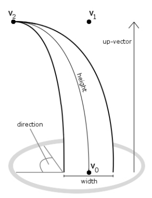

Vulkan Grass Rendering
==================================

**University of Pennsylvania, CIS 565: GPU Programming and Architecture, Project 5**

* XiaoyuDu
* Tested on: Windows 10, i9-11900KF @ 3.50GHz, RTX 3080 (Personal PC)

### Description  
This project reproduced the grass simulation methods proposed in the paper "Responsive real-time grass rendering for general 3D scenes" by Klemens Jahrmann and Michael Wimmer. The whole project is driven by Vulkan and openGL. All the calculations proposed in this paper are performed all on the shaders, making it appliable to different kinds of real-time scenarios. The paper used the following models to describe a balde of grass.

   

`v0`, `v1` and `v2` and the three control points which forms a beizier curve to represent the blade using Tessellation shaders.  
`height` represents the length of the blade.  
`direction` represents the orientation of the blade.  
`width` represents the length of the cross-section width of the blade.  
`up-vector` represents the normal of the ground.  

   

Besides the grass model, different forces are also been considered and been modeled in the paper, as the graph shwon above.  
`gravity` includes enviornmental gravity and front gravity which simulates the elasticity of a blade.  
`recovery` is a force that against any force that try to bends itself.  
`wind` is a force that changes from moment to moment, which can make the whole grass simulation look more realistic.  
  
In this project, I implemented the basic graphics and compute pipeline to render the grass and compute the forces that effect each blade. Three forces I mentioned above has all been taken into account, and three culling methods are also been implemented to further increase the performance.    

### Feature  
* Basic pipeline  
I first built the graphics pipeline using Vulkan and try to render the grass out. Based on the paper, I used a Tessellation shader with a inner and outer layer of 16 to compute the Bezier curve for each blade to generate smooth shape for each blade. The position and direction of each blade are generated randomly. The total number of blades are set to 2^10. The result looks like the picture shown below.  

  
  
* Forces  
After I finished the graphics pipeline, I started to generate the compute pipeline and added the effects of the three forces in the compute shader. The effects of each force are implemented based on their models mentioend in the paper. The gravity force includes a enviornmental universal gravity and a front gravity for each blade and they always act on the v2 point of each blade. Each blade always has a recover force that try to make itself straight up again. the wind force are simulated using sin and cos function with the uniform time variable so that the direction of the wind is always changing. Now, the simulation result looks like the graph shown below. 

  
  
  
* Culling Method
Then, three kinds of culling methods are implemented to make the performance better. The first method is called orientation culling which wipes out the balde with direction similar to the view direction of camera, because for those blades, we can only see their sides and thus we may don't need to render them. The second method is called view-frustum culling, which wipe out all the blade outside the current view space. The third method is called distance culling that wipes out the blades that are far away from the camera. The results of three culling method are shown below.   
At first gif, you can see that each blade with similar direction to camera's view will disappear. At second gif, you can see that blade at the corner of the camera's view space will tend to disappear. At the third gif, you can see that blade will disappear once they are far away.  

| Orientation Culling | View-Frustum Culling | Distance Culling  |
| --- | --- | --- |
|  |  |  |
  
A result that integrate all of the above methods is shown below.  

   
  
### Performance Analysis  
In the chart below, I compare the FPS between different number of blades. The result totally make sense that with more number of blades, the FPS will shrink. You can see that even with 2^17 blades, the FPS still can be as high as about 52.  

    
   
This chart below compares the effects of different culling method. The interesting thing to notice is that in some cases, view frustum cull and distance cull actually make performance worse. Later on I found out that the problem is not on my implementation, but on the scene itself.  view frustum cull and distance cull are expensive, especially for frustum cull that we have to use two points of blade and one mid point been interpolated and do a bound-check operation on all of them. Thus, if there are not too many blades been wiped out, the expenses for doing the check will become higher than the performance saved by wiping out blades that we don't need to render. In this chart, I did all the test using the default camera position where it is at the middle of the grass land. Not many blades were culled. However, When I switch the camera to the middle and be really close to the ground and test for view frustum cull, it outperform every other method. when I switch the camera to really far away and only a few blades left, the distance cull outperform every other methods. So I think this two method is highly scene-dependent.  

   
