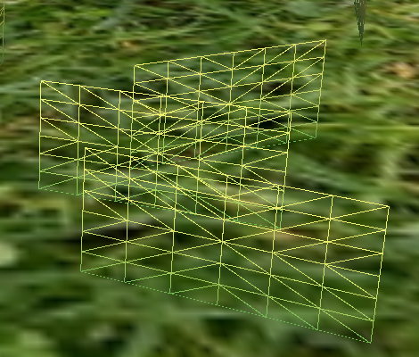

Vulkan Grass Rendering
==================================

**University of Pennsylvania, CIS 565: GPU Programming and Architecture, Project 5**

* Chang Liu
  * [LinkedIn](https://www.linkedin.com/in/chang-liu-0451a6208/)
  * [Personal website](https://hummawhite.github.io/)
* Tested on personal laptop:
  - i7-12700 @ 4.90GHz with 16GB RAM
  - RTX 3070 Ti Laptop 8GB

<div align="center">Autumn dusk...</div><br>

## Overview

This is a grass simulator & renderer based on Vulkan computer shader and tessellation shader. The main idea came from K. Jahrmann and M. Wimmer's paper [*Responsive Real-Time Grass Rendering for General 3D Scenes*](https://www.cg.tuwien.ac.at/research/publications/2017/JAHRMANN-2017-RRTG/JAHRMANN-2017-RRTG-draft.pdf).

## Features

### Mesh Generation Using Tessellation Shader and Bezier Patch

| Mesh Generated by Tessellation | Remapped using Bezier Control Points |
| ------------------------------ | ------------------------------------ |
|      |           |

To generate triangle meshes that fit into blade shapes, we first use tessellation shader to generate raw vertices. Usually, the tessellating process is like:

- First, we specify the detail of tessellation (inner level and outer level) in tessellation control shader
- Then, the tessellation primitive generator will create a bunch of vertices according to details of tessellation. Each vertex carries a tessellation coordinate `uv`, which ranges from (0, 0) to (1, 1) if we use quad mode
- Last, in tessellation evaluation shader, we decide the position of these new vertices based on their tessellation coordinates. For example, a vertex's position can be sampled on a height map using these coordinates `position = texture(heightMap, uv)`
- After tessellation, these vertices are guaranteed to be assembled to the primitives we specify when creating the pipeline


In this project, blades are represented as Bezier curves. Therefore, in tessellation evaluation shader, what we need to do is to remap vertex positions based on control points `v0`, `v1`, `v2` and some other parameters shown in the figure, which can be written as a simple function `position = curve(v0, v1, v2, up, width, height, direction, uv)`.

### Force Simulation

#### Gravity + Recovery

| No Force                | Gravity + Recovery      |
| ----------------------- | ----------------------- |
|  |  |

The recovery model of treats blades like a spring and even the formula of recovery force is derived from Hook's law.

#### Wind

To let wind effect vary by time and blade position, and appear like "waves", I developed a function:

```glsl
vec3 wind(vec3 pos, float time) {
    vec3 d = vec3(cos(time * 0.1 + 0.1), 0.0, sin(time * 0.1 + 0.1));

    float v = dot(pos, d);
    float u = sqrt(max(dot(pos, pos) - v * v, 0.0));

    float sinU = sin(u - time * 3.0) * 0.3 + 0.5;
    float sinV = sin(v - time * 4.0) * 0.5 + 0.5;

    return d * (sinU + sinV + 0.1) * 4.0;
}
```

which gives an effect like this:


### Culling

#### Distance


#### Frustum

Discard blades out of camera frustum. This is simple to achieve by projecting blade coordinate into clip space, then check if any of `x, y, z` is greater than `w`.

#### Orientation


### Dynamic Tessellation Level

In tessellation control shader, we can control the detail of tessellation. That is, how many triangles to be generated. When rendering, it is expected that the level of detail (LOD) of triangle mesh can dynamically adjust with respect to it's distance from camera: if a blade is far from camera, then it's not necessary to tessellate it with high LOD.


My function mapping distance and tessellation level is in this form:

```glsl
float getTessselLevelOfDetail(float d) {
    if (d < distanceA) {
        return levelA;	// Near blades higher LOD
    }
    else if (d < distanceB) {
        return levelB;
    }
    else if (d < distanceC) {
        return levelC;	// Distanced blades lower LOD
    }
    else ...
}
```

I'd say it reminds me of Cascaded Shadow Map. 

## Performance

Note: The LOD of tessellation is set to 20 without dynamic LOD optimization.


The graph shows how adding different optimization methods step by step reduces rendering time as well as how rendering changes with different number of blades.

We have the following conclusions:

- Rendering time is almost proportional to blade number. This indicates our rendering algorithm has good scalability
- Dynamic LOD is the most effective optimization. It's reasonable that it reduces significant amount of vertex data generated by tessellation shader and passed to vertex shader
- Each of three culling methods has similar speedup. However, depending on how much blades appear in camera's frustum, the speedup of frustum culling could vary
