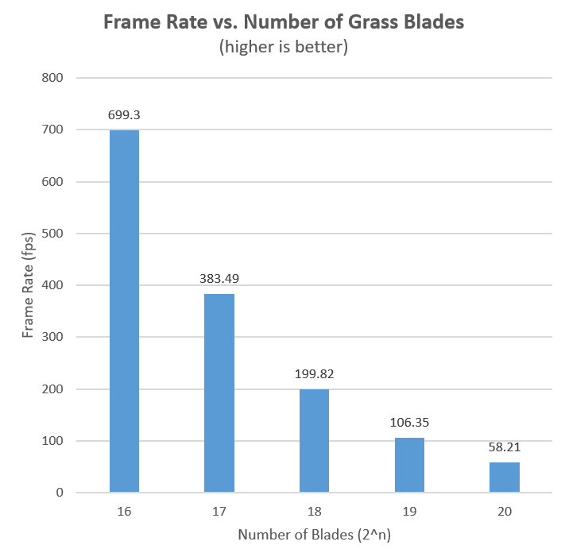

Vulkan Grass Rendering
==================================

**University of Pennsylvania, CIS 565: GPU Programming and Architecture, Project 4**

* Haoquan Liang
  * [LinkedIn](https://www.linkedin.com/in/leohaoquanliang/)
* Tested on: Windows 10, Ryzen 7 5800X 8 Core 3.80 GHz, NVIDIA GeForce RTX 3080 Ti 12 GB

# Overview
This project is a grass simulator and renderer using Vulkan API. It is based on [Responsive Real-Time Grass Rendering for General 3D Scenes](https://www.cg.tuwien.ac.at/research/publications/2017/JAHRMANN-2017-RRTG/JAHRMANN-2017-RRTG-draft.pdf), which allows us to render fields of grass of arbitrary shapes and spatial alignment efficiently and realistically.   
Outside learning grass simulation, one of the main goal of this project is to about the classical rendering pipeline of Vulkan (vertex->tesselation control->tesselation->fragment->compute) and how tesselation and level of details works.    

# Table of Contents  
* [Features](#features)  
	* [Force Simulation](#simulation)
	* [Blades Culling](#culling)
	* [Tessellation with Levels of Details (Extra Credit)](#lod)
* [Performance Analysis](#performance)   
* [Reference](#reference)

# <a name="features"> Features</a>
## <a name="simulation">Force Simulation</a>
We represent the grass blade Bezier curves, where `v0` is the position of the grass blade on the geomtry, `v1` is a Bezier curve guide that is always "above" `v0` with respect to the grass blade's up vector, and `v2` is a physical guide for which we simulate forces on.    
We simulate forces on grass blades while they are still Bezier curves. We apply the transformations to `v2`initially and correct for potential errors. Then, we update `v1` to maintain the appropriate length of our grass blade.   

### Gravity Force   
Given a gravity direction, `D.xyz`, and the magnitude of acceleration, `D.w`, we can compute the environmental gravity in our scene as `gE = normalize(D.xyz) * D.w`.   
We then determine the contribution of the gravity with respect to the front facing direction of the blade, `f`, as a term called the "front gravity". Front gravity is computed as `gF = (1/4) * ||gE|| * f`.   
We can then determine the total gravity on the grass blade as `g = gE + gF`.   
**As shown in the following image, when a small gravity force is applied, the grass will slowly transform to touch the ground.**    

### Recovery Force
Recovery corresponds to the counter-force that brings our grass blade back into equilibrium. This is derived in the paper using Hooke's law. In order to determine the recovery force, we need to compare the current position of `v2` to its original position before simulation started, `iv2`. At the beginning of our simulation, `v1` and `v2` are initialized to be a distance of the blade height along the `up` vector.   
Once we have `iv2`, we can compute the recovery forces as `r = (iv2 - v2) * stiffness`.   
**As shown in the following image, when both the gravity and recovery force are applied, the grass will have the tips facing down, but it will reach a stasis (stiff) state.** 

### Wind Force
The wind can have any direction, to make it more interesting, I made its direction `vec3(cos(totalTime * 2), 0.f, fbm1D(totalTime))` so that the grass will sway in the left-right direction, and have some random small movements on the forward direction.    
Additionally, the wind has a larger impact on grass blades whose forward directions are parallel to the wind direction, which is referred to as `windAlignment` term.     
With a wind direction and a wind alignment term, the total wind force (`w`) will be `windDirection * windAlignment`.   
**As shown in the following image, with only wind force applied, the grass sway left and right, with some small random movements forward.**   

## <a name="culling">Blades Culling</a>
### Orientation Culling
Consider the scenario in which the front face direction of the grass blade is perpendicular to the view vector. Since our grass blades won't have width, we will end up trying to render parts of the grass that are actually smaller than the size of a pixel. This could lead to aliasing artifacts.   
To remedy this, we can cull these blades! Simply do a dot product test to see if the view vector and front face direction of the blade are perpendicular. The cull threshold used is `0.9`.   
**As shown in the following image, only the blades that faces the camera will be rendered.**

### View-Frustum Culling
We also want to cull blades that are outside of the view-frustum, considering they won't show up in the frame anyway. To determine if a grass blade is in the view-frustum, we want to compare the visibility of three points: `v0, v2, and m`, where `m = (1/4)v0 * (1/2)v1 * (1/4)v2`.   
If all three points are outside of the view-frustum, we will cull the grass blade.    
**As shown in the following image, only the grass blades within the view-frustum will be rendered.**   

### Distance Culling
Similarly to orientation culling, we can end up with grass blades that at large distances are smaller than the size of a pixel. This could lead to additional artifacts in our renders. In this case, we can cull grass blades as a function of their distance from the camera.   
The maximum distance used is `30` and the number of buckets to place grass blades between the camera is `10`.    
**As shown in the following image, only the grass blades within the distance will be rendered.***   

### <a name="lod">Dynamic Tesselation - Levels of Details</a>
If the grass blade is very far from the camera, there is no need to generate a high tesselation level for it. We can vary the levels of details as a function of how far the grass blade is from the camera to further optimize the performance.    
**As shown in the following image (rendered in wireframe mode), the blades closer to the camera have more polygons than the blades further away.**    

# <a name="performance">Performance Analysis</a>
### Varying Number of Grass Blades

### Improvements with Culling
 

# <a name="reference">Refrence</a>
* [Responsive Real-Time Grass Grass Rendering for General 3D Scenes](https://www.cg.tuwien.ac.at/research/publications/2017/JAHRMANN-2017-RRTG/JAHRMANN-2017-RRTG-draft.pdf)
* [CIS565 Vulkan samples](https://github.com/CIS565-Fall-2017/Vulkan-Samples/tree/master/samples/5_helloTessellation)
* [Official Vulkan documentation](https://www.khronos.org/registry/vulkan/)
* [Vulkan tutorial](https://vulkan-tutorial.com/)
* [RenderDoc blog on Vulkan](https://renderdoc.org/vulkan-in-30-minutes.html)
* [Tessellation tutorial](https://ogldev.org/www/tutorial30/tutorial30.html)