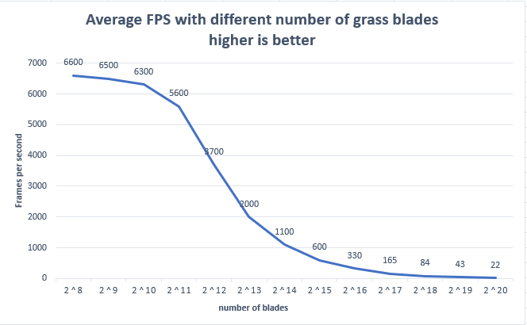
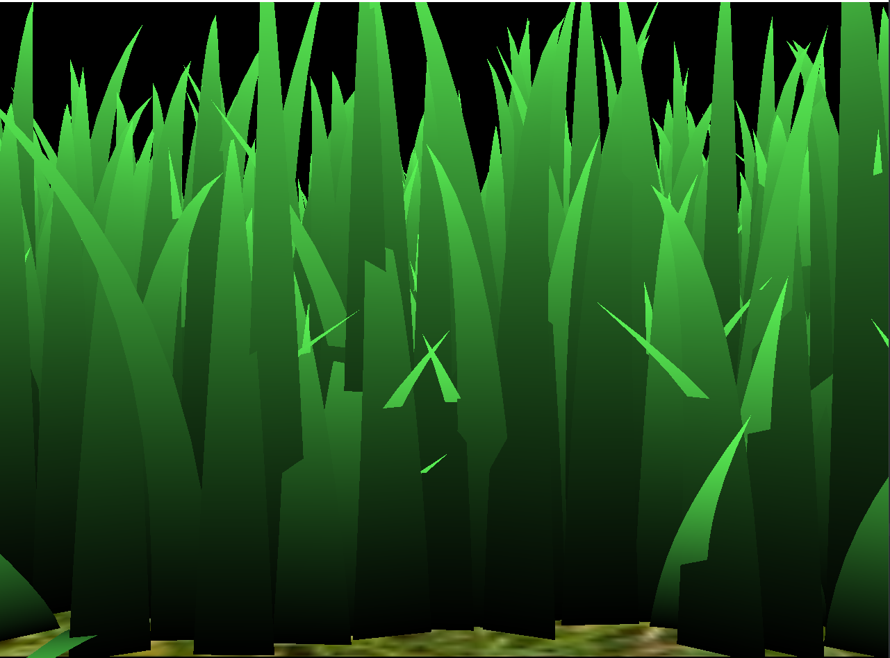

Vulkan Grass Rendering
==================================

**University of Pennsylvania, CIS 565: GPU Programming and Architecture, Project 5**

* Shineng Tang
  * [LinkedIn](https://www.linkedin.com/in/shineng-t-224192195/)
* Tested on: Windows 11, i9-10900k @3.7GHz 32GB, RTX 3090 24GB

## Proejct Description
This is a Vulkan grass simulator that simluates the animation of the grass under the impact of physical forces. 
Throughout the development, I further understand Vulkan rendering pipeline.
 

## Features
### Representing Grass as Bezier Curves
 

Each blade of grass is represented by Bezier curve.
Each curve  has three control points.
* `v0`: the position of the grass blade on the geomtry
* `v1`: a Bezier curve guide that is always "above" `v0` with respect to the grass blade's up vector 
* `v2`: a physical guide for which we simulate forces on

There are also different characteristics of the grass storing in the w element of each vector
* `up`: the blade's up vector, which corresponds to the normal of the geometry that the grass blade resides on at `v0`
* Orientation: the orientation of the grass blade's face
* Height: the height of the grass blade
* Width: the width of the grass blade's face
* Stiffness coefficient: the stiffness of our grass blade, which will affect the force computations on our blade

### Physics Simulation
The animation of the grass blades are affected by gravity, recovery force and the wind.
 

### Different Culling Method

| Distance Culling  | Orientation Culling |
|---|---|
|||

| No Culling  | View-Frustrum Culling |
|---|---|
|||

The visual effect of View-Frustrum Culling is not obvious. But we can tell from the gifs above that when the grass blades are outside of the window, they are culled so the fps goes extremely higher. However, if I disable the culling, the fps remains approximately on the same level even if the blades are not rendered inside the window.

## Performance Analysis

The framerates when rendering relatively larger number of blades are proportionate to the number of blades. When I double the number of blades, the framerates will be approximately halved. The reason of why the framerates do not change relatively a lot for the small numbers of blades is that it reaches certain threshold of the power of my GPU.

For the default camera angle and the grass blades number of 2^15, the most effcient culling method is the orientation culling and the least effcient one is the view-frustrum method. The result is expected. For the view-frustrum method with the default camera angle, not a lot of blades are outside of the camera, so it produces a slight boost on the fps. For the orientation method, a lot of blades are culled because the camera contains a huge portion of the blades in the scene and they are culled based on their orientations towards the camera.

### Default Camera Angle

