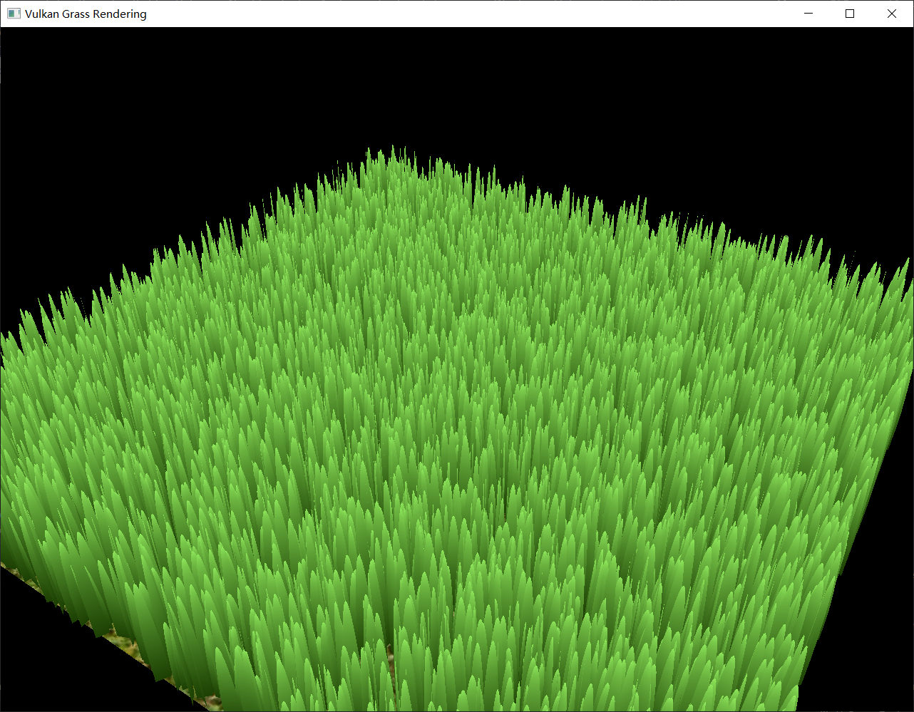
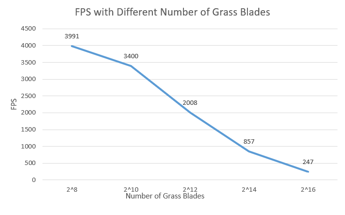
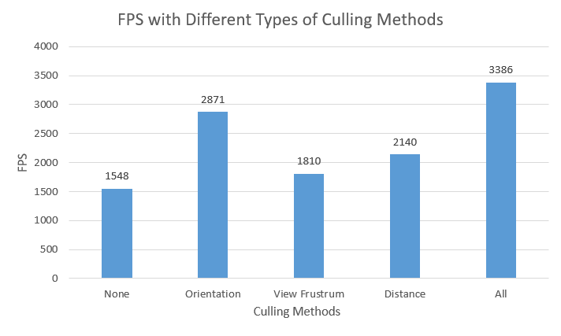

Vulkan Grass Rendering
==================================

**University of Pennsylvania, CIS 565: GPU Programming and Architecture, Project 5**

* Zhuohao Lin
  * [LinkedIn](https://www.linkedin.com/in/zhuohao-lin-960b54194/)
* Tested on: Windows 10, i7-10875H @ 2.30GHz 16GB, NVIDIA Grforce RTX 2060 6GB (personal machine)

# Overview
This project implements real-time grass rendering based on a [paper](https://www.cg.tuwien.ac.at/research/publications/2017/JAHRMANN-2017-RRTG/JAHRMANN-2017-RRTG-draft.pdf) about `responsive real-time rendering for general 3D scenes`.

# Features
### `Physics Simulation`
I apply recovery, gravity and wind forces on the grass in this project. The comparison between using forces and not using forces is shown below.
Without Forces             |  With Forces 
:-------------------------:|:-------------------------:
       |  

### `Optimizations by Culling`
By culling grass based on orientation, view frustrum and distance, the program gets quite obvious FPS improvement.

Orientation Culling:

View Frustrum Culling:

Distance Culling:

# Performance Analysis

### `How performance of the renderer change with different number of grass blades`

The FPS drops as the number of grass blades increases. This is expected since there are more data needs to be computed with more grass blades.

### `Improvement from Culling`
All of the data below are derived under 640 x 480 resolution with 213 grass blades.

As we can see, all of culling methods contribute decent amount of performance improvements, especially for the orientation culling. This is simply because I set the threshold for culling low.
