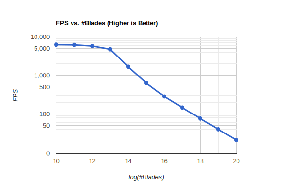
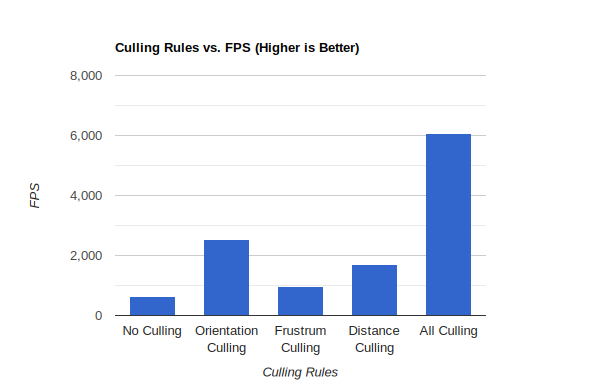

Vulkan Grass Rendering
==================================

**University of Pennsylvania, CIS 565: GPU Programming and Architecture, Project 5**

* Yuanqi Wang
  * [LinkedIn](https://www.linkedin.com/in/yuanqi-wang-414b26106/), [GitHub](https://github.com/plasmas).
* Tested on: Windows 11, i5-11600K @ 3.91GHz 32GB, RTX 4090 24GB (Personal Desktop)

## Overview

A quadratic Bézier curve is a parametric curve used in computer graphics and related fields to model smooth curves. Using quadratic Bézier curves to model grass allows for both aesthetic realism and computational efficiency. This method can create a wide variety of grass shapes and appearances by simply adjusting the positions of the control points. It's particularly effective in real-time rendering applications, like video games or simulations, where performance is critical, but a reasonable level of realism is also required.

In this project, I simulate the grass using quadratic Bézier curves based on the method introduced in this paper: [Responsive Real-Time Grass Rendering for General 3D Scenes](https://www.cg.tuwien.ac.at/research/publications/2017/JAHRMANN-2017-RRTG/JAHRMANN-2017-RRTG-draft.pdf).

The blade of grass is represented using a quadratic Bézier curve defined by three control points and some essential attributes: 

$v_0$: This is the base point, anchored at the ground level. It acts as the starting point of the grass blade.

$v_1$: This is the control point that doesn't lie on the curve itself but influences its shape. It essentially dictates the bend or curvature of the grass blade.

$v_2$: This is the endpoint of the curve and represents the tip of the grass blade.

*direction:* The general leaning or orientation of the grass blade.

*height:* The height of grass blade from base to tip (from $v_0$ to $v_2$).

*width:* The thickness of the grass blade base.

*up-vector:* a directional vector indicating the vertical orientation in 3D space. This usually aligned with the normal of the plane.

## Features
### Physics Simulation

To properly simulate grass movement, a combination of recovery, gravity, and wind is used. These animations show grass movement when different forces are considered:

| No Force  | Gravity Only |
|---|---|
|||

| Gravity + Recovery  | Gravity + Recovery + Wind |
|---|---|
|||

It is clear that when no force is applied, all blades of grass sts the same. When gravity is the only force, all grass fell to the ground since there is no stiffness or recovery force. When Recovery force is added, blades now have a natural curve. And finally when wind force is applied, the grass will move as wind direction and strength are different at varying locations and times.

### Culling

To improve performance, different culling methods are used to discard blades that are not or less visible.

| No Culling  | Orientation Culling |
|---|---|
|||

| Frustrum Culling | Distance Culling |
|---|---|
|||

With orientation culling we can see that some blades which are alighed with the viewing direction is omitted. With frustrum culling, If all $v_0$, $v_2$, and $m$ are not in the frustrum, the blade will be omitted. With distance culling, blades that are too far away will be omitted.

### Performance Analysis

#### Number of Blades
To analyse performance, we tested FPS under different number of blades. No culling is used in this testing.

Since both axis are log-based. We can see that the FPS decreases linearly with the number of blades. This is expected as the render cost increases linearly with the number of blades.

#### Culling

The actual performance benefit we can get from culling is highly dependent on the camera's position and viewing direction, as well as culling parameters. As a rule of thumb, the more blades culled by some culling rule, the more benefits we will gain from that rule. However, it does not mean that culling rules that yield less performance boost is less important, as it will vary a lot based in different scene and viewing situations.

For this part, I solely examine the FPS boost I get when not moving the position and viewing angle of the camera. The number of blades is set to $10^{15}$.

We can see that this is camera setup, performance benefits greatly from orientation culling. This is expected as a lot of the blades will be discarded based on their orientation against the camera. Frustrum culling introduces a small performance gain because in this camera setup, most of the blades are still within the frustrum. With all three culling enabled, a huge performance boost is obtained, as a massive portion of blades that are not visible is reduced from the rendering.
