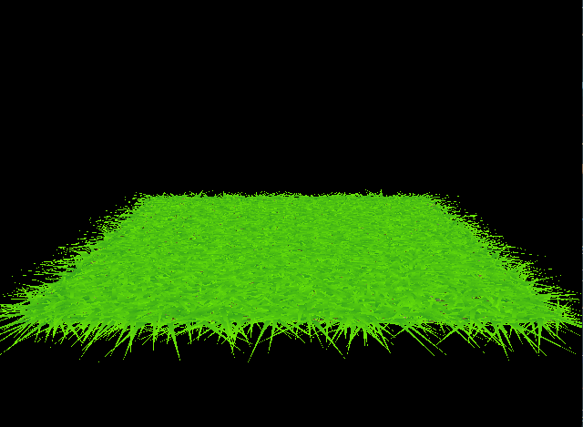

Vulkan Grass Rendering
==================================

**University of Pennsylvania, CIS 565: GPU Programming and Architecture, Project 5**

* Wenqing Wang
  * [LinkedIn](https://www.linkedin.com/in/wenqingwang0910/) 
* Tested on: Windows 11, i7-11370H @ 3.30GHz 16.0 GB, GTX 3050 Ti

## Overview 
This project implemented a grass simulator and renderer using Vulkan. The implementaion is heavily based on [Responsive Real-Time Grass Rendering for General 3D Scenes](https://www.cg.tuwien.ac.at/research/publications/2017/JAHRMANN-2017-RRTG/JAHRMANN-2017-RRTG-draft.pdf).

## Introduction
### Representing Grass as Bezier Curves

In this project, grass blades were represented as Bezier curves while performing physics calculations and culling operations. 

Each Bezier curve has three control points.
* `v0`: the position of the grass blade on the geomtry
* `v1`: a Bezier curve guide that is always "above" `v0` with respect to the grass blade's up vector (explained soon)
* `v2`: a physical guide for which we simulate forces on

I also store per-blade characteristics that help simulate and tessellate grass blades correctly.
* `up`: the blade's up vector, which corresponds to the normal of the geometry that the grass blade resides on at `v0`
* Orientation: the orientation of the grass blade's face
* Height: the height of the grass blade
* Width: the width of the grass blade's face
* Stiffness coefficient: the stiffness of our grass blade, which will affect the force computations on our blade

## Physical Simulation
| No force | Gravity |
|--|--|
| | |

| Gravity + Recovery | Gravity + Recovery + Wind |
|--|--|
| | |
### Gravity

Given a gravity direction, `D.xyz`, and the magnitude of acceleration, `D.w`, we can compute the environmental gravity in our scene as `gE = normalize(D.xyz) * D.w`.

We then determine the contribution of the gravity with respect to the front facing direction of the blade, `f`, as a term called the "front gravity". Front gravity is computed as `gF = (1/4) * ||gE|| * f`.

We can then determine the total gravity on the grass blade as `g = gE + gF`.

#### Recovery

Recovery corresponds to the counter-force that brings our grass blade back into equilibrium. This is derived in the paper using Hooke's law. In order to determine the recovery force, we need to compare the current position of `v2` to its original position before simulation started, `iv2`. At the beginning of our simulation, `v1` and `v2` are initialized to be a distance of the blade height along the `up` vector.

Once we have `iv2`, we can compute the recovery forces as `r = (iv2 - v2) * stiffness`.

#### Wind

In order to simulate wind, I create a wind function that changes with time. This function will determine a wind direction that is affecting the blade, but it is also worth noting that wind has a larger impact on grass blades whose forward directions are parallel to the wind direction. The paper describes this as a "wind alignment" term. 

Considering these 2 factors, the total wind force (`w`) will be `windDirection * windAlignment`.

#### Total force

After calculating the forces mentioned above, we can determine the translation of `v2`, i.e. `tv2=(gravity+recovery+wind)*deltaTime'. In addition to this, we need to do some verification tests to make sure that situations like control point `v2` under the ground or blades of grass changing length do not occur.

## Culling
Although we need to simulate forces on every grass blade at every frame, there are many blades that we won't need to render due to a variety of reasons. Below are some heuristics that I implement to cull blades that won't contribute positively to a given frame.
| Orientation culling | View-frustum culling |
|--|--|
| | |

| Distance culling | Apply all |
|--|--|
| | |

#### Orientation culling

Consider the scenario in which the front face direction of the grass blade is perpendicular to the view vector. Since our grass blades won't have width, we will end up trying to render parts of the grass that are actually smaller than the size of a pixel. This could lead to aliasing artifacts.

In order to remedy this, we can simply do a dot product test to see if the view vector and front face direction of the blade are perpendicular. 

#### View-frustum culling

We also want to cull blades that are outside of the view-frustum, considering they won't show up in the frame anyway. To determine if a grass blade is in the view-frustum, we can compare the visibility of three points: `v0, v2, and m`, where `m = (1/4)v0 * (1/2)v1 * (1/4)v2`.

If all three points are outside of the view-frustum, we will cull the grass blade. The paper uses a tolerance value for this test so that we are culling blades a little more conservatively. This can help with cases in which the Bezier curve is technically not visible, but we might be able to see the blade if we consider its width.

#### Distance culling

Similarly to orientation culling, we can end up with grass blades that at large distances are smaller than the size of a pixel. This could lead to additional artifacts in our renders. In this case, we can cull grass blades as a function of their distance from the camera.

