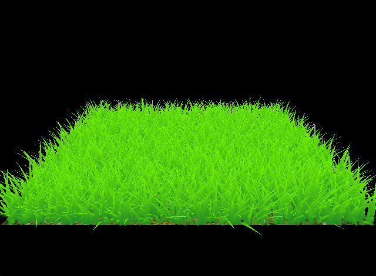

Vulkan Grass Rendering
==================================

**University of Pennsylvania, CIS 565: GPU Programming and Architecture, Project 5**

  
An implementation of Vulkan grass Rendering based on [Responsive Real-Time Grass Rendering for General 3D Scenes](https://www.cg.tuwien.ac.at/research/publications/2017/JAHRMANN-2017-RRTG/JAHRMANN-2017-RRTG-draft.pdf). Including bezier curve grass rendering and blade culling.
* Tom Donnelly
  * [LinkedIn](https://www.linkedin.com/in/the-tom-donnelly/)
* Tested on: Windows 11, AMD Ryzen 9 5900X, NVIDIA GeForce RTX 3070 (Personal Desktop)

### Implementation
The grass blades were initially implemented with no forces or culling, resulting in a standing blade.  
  
Forces were then added to the blades:    
Wind, made using a sin function:  
   
Gravity:   
    
Recovery, based on blade stiffness:  

Culling methods were then added to increase performance:  
Orientation Culling:    
  
Frustrum Culling:  
  
Distance Culling:  
  

### Analysis
Number of grass blades and culling techniques were analyzed. 
   
| 256 Blades | 16384 Blades | 1048576 Blades |
| ---------- | ------------ | -------------- |  
|            |                |                 |    

    
Extremely high FPS were achieved until around ~260000 blades were simulated at which point the performance drastically decreased.    
  
Distance culling had the most impact on performance which was surprising as I suspected orientation culling may be the most beneficial. Its likely that distance culling is less noticeable and most beneficial as it slightly decreases the number of blades at distances based on bins.  
 
