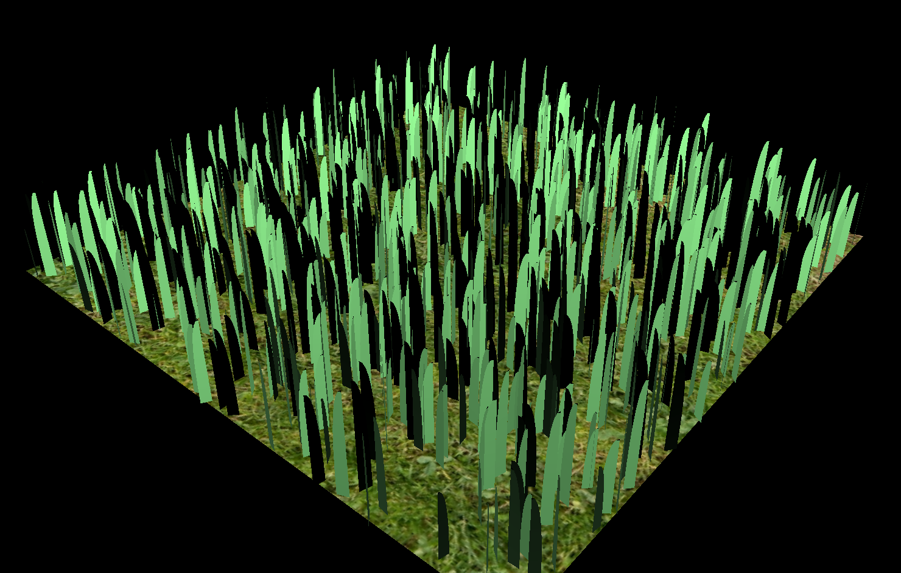

Vulkan Grass Rendering
==================================

**University of Pennsylvania, CIS 565: GPU Programming and Architecture, Project 5**

* XiaoyuDu
* Tested on: Windows 10, i9-11900KF @ 3.50GHz, RTX 3080 (Personal PC)

### Description  
This project reproduced the grass simulation methods proposed in the paper "Responsive real-time grass rendering for general 3D scenes" by Klemens Jahrmann and Michael Wimmer. The whole project is driven by Vulkan and openGL. All the calculations proposed in this paper are performed all on the shaders, making it appliable to different kinds of real-time scenarios. The paper used the following models to describe a balde of grass.
  
`v0`, `v1` and `v2` and the three control points which forms a beizier curve to represent the blade using Tessellation shaders.  
`height` represents the length of the blade.  
`direction` represents the orientation of the blade.  
`width` represents the length of the cross-section width of the blade.  
`up-vector` represents the normal of the ground.  
  
Besides the grass model, different forces are also been considered and been modeled in the paper, as the graph shwon above.  
`gravity` includes enviornmental gravity and front gravity which simulates the elasticity of a blade.  
`recovery` is a force that against any force that try to bends itself.  
`wind` is a force that changes from moment to moment, which can make the whole grass simulation look more realistic.  
  
In this project, I implemented the basic graphics and compute pipeline to render the grass and compute the forces that effect each blade. Three forces I mentioned above has all been taken into account, and three culling methods are also been implemented to further increase the performance.    

### Feature  
* Basic pipeline

I first built the graphics pipeline to render the grass out. Based on the paper, a Tessellation shader with a inner and outer layer of 16 are used to compute the Bezier curve for each blade to generate smooth shape for each blade.  

  
After I finished the graphics pipeline, I started to generate the compute pipeline and added the effects of the three forces based on their models mentioend in the paper.  

  

### Performance Analysis  
