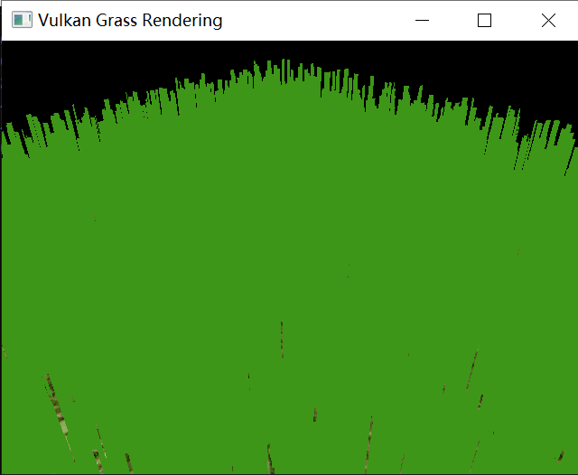
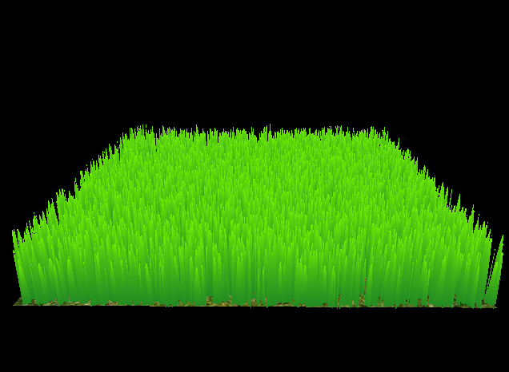
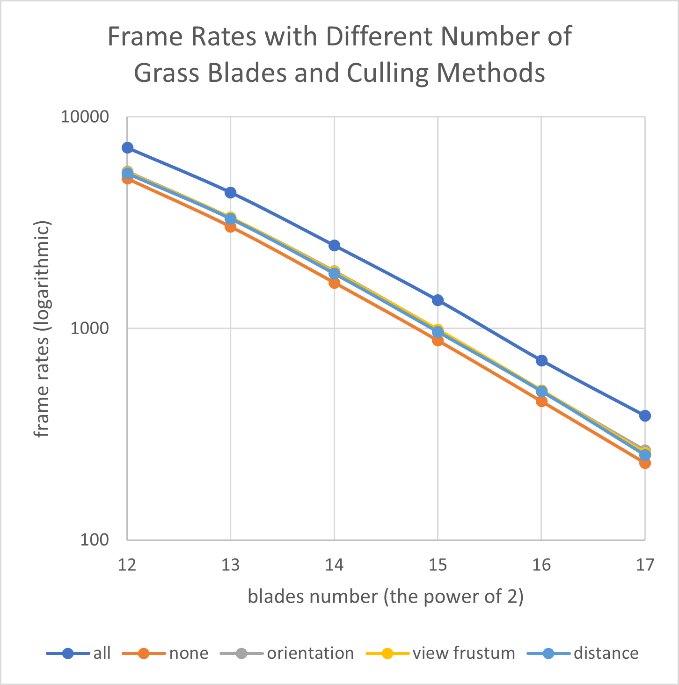
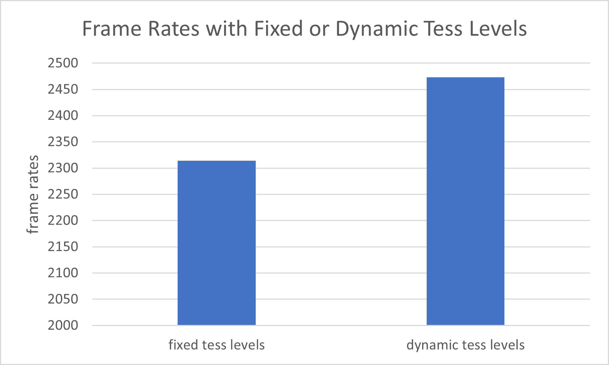

Vulkan Grass Rendering
==================================

**University of Pennsylvania, CIS 565: GPU Programming and Architecture, Project 5**

* Yiyang Chen
  * [LinkedIn](https://www.linkedin.com/in/yiyang-chen-6a7641210/), [personal website](https://cyy0915.github.io/)
* Tested on: Windows 10, i5-8700k @ 3.7GHz, GTX 1080, personal computer

## Overview

In the computing shader, I simulate all the force, and implement 3 culling tests. 

In the tessellation shader, I randomly choose 3 different grass shapes (triangle, quadratic and triangle-tip) to tessellate. And I implement the extra credit: Tessellate to varying levels of detail as a function of how far the grass blade is from the camera.

## Results

First I just draw rectangles with pure color

And then I complete tessellation and fragment shader

Finally I add force and culling, the following GIF is my final result. And because GIF is a bit blurry, I also record a short video: `img/result.mp4`

## Performance Analysis

See the above graph. The blades number is `2^n`, and the frame rate per second is also in logarithmic coordinate. Notice that the `distance` line overlaps the `orientation` line so we can't see the `orientation` line clearly.

* The 3 culling methods all contribute to the performance, and their improvements are almost the same. 
* When the number of blades increases, the frame rate decreases linearly
* From the original data, when applying all the 3 culling methods, the frame rate increases about 50%.

### Dynamic tessellation level

It's with 2^14 grass blades and all culling methods.

We can see that dynamic tess level improve the performance.